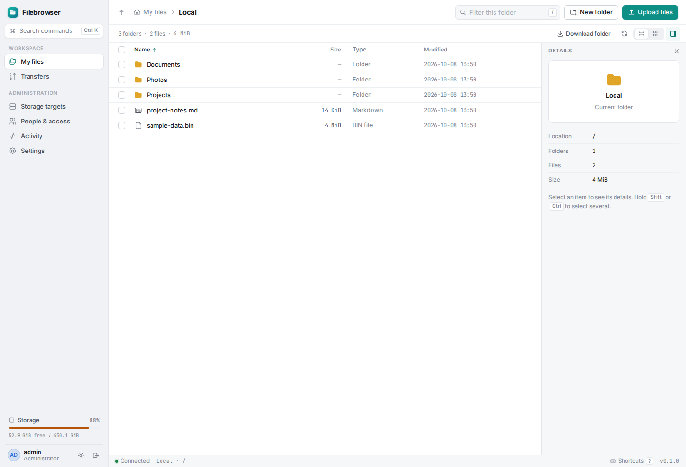
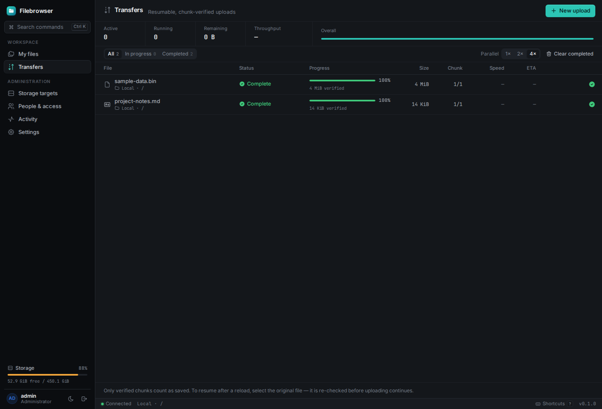

# Filebrowser2

A self-hosted file browser with named storage targets, scoped users and resumable uploads. Run it on your own storage, create the first administrator through the setup wizard, and give each user the access they need.



## Quick start

With Docker Compose:

```sh
docker compose up --build -d
```

Open **http://127.0.0.1:8080** and choose your administrator username and password. The wizard can create an explicit Local target at `/files`, connect remote storage, or leave storage for later. There is no default password or implicit filesystem target. Files and private application state persist in separate Docker volumes.

For local development, use Node.js 24+ and npm 11+:

```sh
npm ci
cp .env.example .env
npm run dev
```

Open **http://127.0.0.1:5173**. The wizard suggests `./data` for a Local target; private account, target and transfer state lives in `./.filebrowser-state`. Both are ignored by Git. The backend listens on port 3000. To build and run a native production instance, use `npm run build` and `npm start` with your chosen storage and state paths.

See [deployment and configuration](docs/deployment.md) for native services, container bindings, HTTPS proxies, backups, and optional whole-host administration.

## Features

- First-run setup, scrypt password hashes, revocable sessions, login throttling, and server-side permission enforcement.
- Administrator console for named local, S3, FTP/FTPS and SFTP targets; encrypted connection secrets, connection checks, read-only controls, and independent user grants and home folders per target.
- Targets as the first level of My files, with target and folder breadcrumbs; files and folders, list/grid views, search, sorting, rename, empty-folder/file deletion, text/image previews, and HTTP byte-range downloads.
- Streamed TAR downloads of folders and mixed selections, including empty directories, without temporary archives. Unfinished uploads and private state are excluded.
- Light, dark and system themes; compact and comfortable layouts; a file inspector, context menus, keyboard shortcuts, and a command palette.
- Resumable uploads up to 1 TiB per file, subject to each target's part-count limit, with SHA-256 manifests and sequential 100 MiB chunks. Each current chunk can use one, two, or four connections.
- Folder selection and drag-and-drop preserve nested paths, with one resumable transfer per file. Folder uploads require upload and create-folder permissions; empty folders are omitted.
- Storage adapters with explicit capabilities: local filesystem, S3-compatible object stores, FTP/FTPS and pinned-host-key SFTP. Local staging supports different mounted filesystems; remote uploads retain at most one local chunk.
- Read-only targets and mounts. Every route, file operation, upload and permission is qualified by target identity. CI publishes signed AMD64/ARM64 container images with all runtime dependencies, including Samba, after checks pass.
- Optional authenticated SMB3 directory shares, managed in Settings, with per-user credentials, read-only access and live permission revocation. See [network sharing](docs/network-shares.md).

Symlinks, traversal segments, special files and reserved `.filebrowser-*` paths are inaccessible through the file API. Native names containing backslashes or control characters are skipped in listings and archives. Users see each target’s independently assigned folder as `/`. Browsing and text previews use the read permission; image previews use the download permission. Upload, create-folder, rename and delete permissions are controlled separately.

See the [complete feature list](FEATURE_LIST.md). Folder archives require download permission; individual file downloads continue to support byte ranges.

## Durable uploads

Before upload, a browser worker scans the source through 4 MiB read buffers and hashes each chunk. It sends the immutable checksum manifest to initialize a session. Chunks commit in order; connections can run concurrently only within the current chunk.

The server streams parts into one temporary chunk and verifies its SHA-256 before committing. Local targets append and fsync; SFTP writes at the durable offset, requests server fsync and verifies saved bytes; S3 uploads checksum-verified multipart parts. SQLite records progress before acknowledgment. Failed attempts retry the entire chunk, and lost acknowledgments do not duplicate bytes.

An unfinished upload appears as `filename.uploading` in the browser. Local targets use a visible hard link; FTP/SFTP keep an owned private remote stage; S3 keeps an incomplete multipart upload. Completion publishes the final name without assembling a second full local file. There is no end-of-upload local concatenation.

After a browser restart, select the original file to verify its manifest again and resume from the committed offset. FTP/FTPS requires restart writes, verifies chunks and checks the entire saved file before publication, but has no portable durable flush or exclusive rename. Use local, SFTP with the fsync extension, or S3 when stronger guarantees are required. See [storage targets and capabilities](docs/storage-targets.md) for protocol limits.

Read [the upload protocol](docs/upload-protocol.md) for state transitions, disk/memory bounds, endpoints, tradeoffs and failure cases. Tests cover real 100 MiB chunks, interrupted transfers, corruption, process crashes, 1 GiB stress uploads and 200 GiB manifests. A full 200 GB payload and physical power-loss testing have not been performed.



The screenshots show disposable demonstration fixtures.

## Development and release

```sh
npm run check
npx playwright install chromium
npm run test:e2e
```

[The testing guide](docs/testing.md) explains the container stress suite and mounted-filesystem fixtures. Verification output is generated locally and excluded from source releases. Application state uses SQLite and needs no database service or generated ORM client.

Read [CONTRIBUTING.md](CONTRIBUTING.md) for development conventions, [SECURITY.md](SECURITY.md) for private vulnerability reporting, and [the release guide](docs/releasing.md) for portable source/runtime packaging. Planned release changes are in [CHANGELOG.md](CHANGELOG.md).

## Project structure

| Path | Purpose |
| --- | --- |
| `frontend/` | File UI, setup, administration, hashing worker and upload coordinator |
| `backend/` | Authenticated HTTP API, SQLite state, storage adapters and upload recovery |
| `shared/` | Shared types, limits and version |
| `tests/` | HTTP, storage, crash-recovery, production and browser checks |
| `scripts/` | Build, packaging and disposable verification tools |
| `examples/` | Portable service configuration |
| `docs/` | Deployment, upload protocol, testing and release guides |
| `licenses/` | Notices for bundled fonts and frontend libraries |

## License and attribution

Project source is [MIT licensed](LICENSE). Third-party packages and bundled fonts retain their own licenses; see [third-party notices](THIRD_PARTY_NOTICES.md). [NOTICE.md](NOTICE.md) credits the starter and interface design influences.
