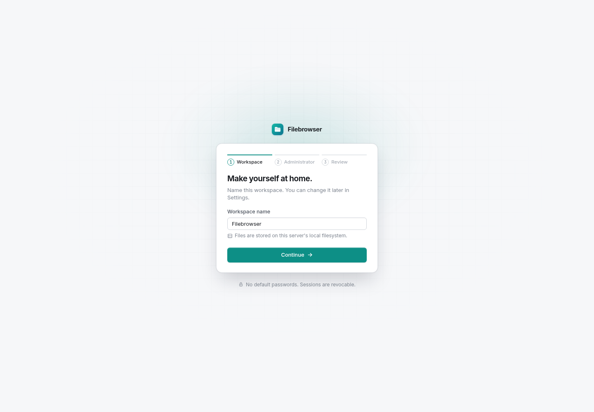
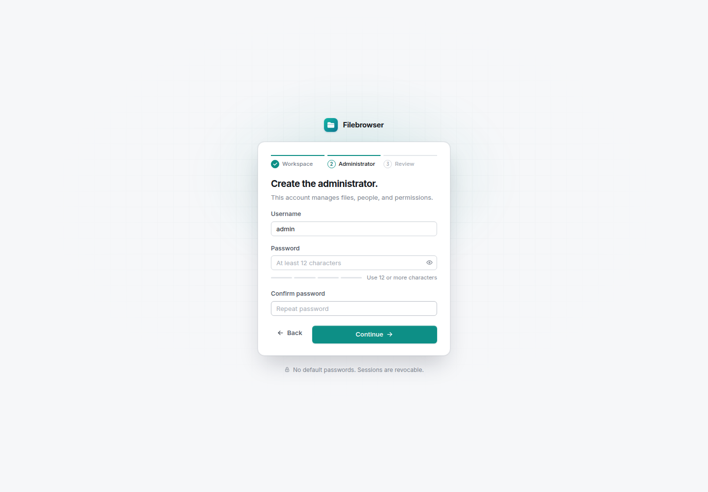
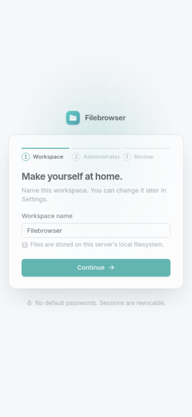

# Filebrowser2 deployment verification

**Result: PASS.** Deployed on `icdesign.com` over SSH port 7822 on 2026-10-06. The service runs as root from `/root/filebrowser2`, listens only on `127.0.0.1:7288`, and manages the host filesystem with storage root `/`. Upstart supervises it and starts it at runlevels 2–5. Commissioning left the setup wizard unsubmitted with zero users and no default password. A later final health check found setup completed with one administrator; that account was preserved.

Application source: `0c27120ce800dee02780316cc1dfdf07306fc4cd`, including the merged frontend redesign and deployment fixes. The server's SHA-256 is `d66a959c4ced001c6364739db35c84a3b4202fb16671d71764cdcaf2a722bb92`, confirmed on the target. [Package provenance](verification/deployed-package.json) records the exact 81-package production dependency graph and runtime hashes. Release transfer SHA-256 was checked before extraction.

The [deployment report, evidence and screenshots bundle](https://transfer.ke.wang/attachments/9c6f7f07b42773998a697e6f74114dc4?fileName=filebrowser2-deployment-2026-10-06.tar.gz) was uploaded to session `111111`. Its SHA-256 is `7358e446f6d0c1f9fb4cf9ca26458f47ff235e108d8f374dc356ac22165e4bda`; the downloaded bytes were compared with the original archive. [Transfer receipt](verification/bundle-transfer.json).

## Installed configuration

| Setting | Verified value |
| --- | --- |
| Supervisor | Upstart 1.12.1; `/etc/init/filebrowser2.conf` passed `init-checkconf` |
| Listen address | `127.0.0.1:7288`; exactly one matching listener |
| Application user | root, effective UID 0 |
| Storage root | `/`; admin scope `/` and all six application permissions tested with disposable state |
| Private account state | `/root/filebrowser2/.filebrowser-state`, directory mode 0700, database mode 0600 |
| Runtime | Private Node 24.21.0 and Debian 12 loader/libraries; application 39 MiB, runtime 126 MiB |
| System runtime | Node 16.17.1 retained; existing PM2 processes 15520 and 17867 remained running |
| Production upload limits | 100 MiB per chunk, up to four connections within a chunk, 1 TiB file limit |
| Final service PID | 47991 at the recorded final status check |
| Production bootstrap at commissioning | `needsSetup: true`, `user: null`; read-only SQLite query confirmed zero users |
| Final production bootstrap | `needsSetup: false`; read-only query confirmed one administrator and one setup event |

The installed PM2 CLI failed to load `debug`; its daemon and existing applications were left intact. Docker 1.6.2 was also left intact. Deployment used SCP and an offline application/runtime package; no npm install, system runtime replacement or database service was needed on the target. The private executable wrapper invokes its own loader, rather than the host loader.

## Container checks

An isolated Compose project, `filebrowser-deploy-verify`, built the application and verification runner. Its runner used disposable PostgreSQL and a separate tmpfs mounted below the test storage root. `npm run check` passed lint, type checks, production builds and **39 tests: 39 passed, zero failures, zero skips**. See [container output](verification/container-check.log).

Additional mounted-filesystem coverage checks corruption rollback, strict chunk order, recovery of a missing pending alias, uncommitted-tail truncation, publication without overwriting an existing file, interrupted publication/cancellation cleanup, retained registry when the recorded filesystem is unavailable, orphan cleanup and destination-device capacity reporting. New configuration checks reject publicly accessible in-root account state, including the root-path boundary case, and confirm reserved state cannot be listed or downloaded.

The offline package also passed a localhost HTTP smoke check with disposable file/state directories: health, fresh setup bootstrap, the default chunk size and production assets. [Result](verification/package-smoke-results.json). Final repository lint passed after adding deployment scripts. The verification PostgreSQL container was stopped afterward.

## Actual target upload checks

The target checks used a separate private account database and unique folders under `/root/filebrowser2` and `/mnt/sda3`. They did not provision a production administrator. The target has two distinct ext4 devices: root device 2049 and secondary device 2051.

Each completed fixture was **105,906,193 bytes (101 MiB + 17)**, with a real **104,857,600-byte first chunk** and a second chunk. Full-file SHA-256 after completion was `5375c2251a16c545f6afde77533bff31a4b58d5869215eb2cada62162629deae` on both devices.

| Assertion | Root device | Separate disk |
| --- | --- | --- |
| Payload staging shares destination device | PASS | PASS; private registry symlink points to device-local stage |
| Four simultaneous connections within each current chunk | PASS | PASS |
| Chunk 1 rejected before chunk 0 commits | HTTP 409 | HTTP 409 |
| Pending `.uploading` file cannot be downloaded | HTTP 409 | HTTP 409 |
| SIGKILL after first chunk commits | PID 47316 terminated | PID 47331 terminated |
| Restart retains 100 MiB committed offset | PASS; PID 47331 | PASS; PID 47352 |
| Injected uncommitted tail is truncated | PASS | PASS |
| Pending and completed file keep the same inode | 60817411 | 2106824 |
| Completed bytes equal the entire original fixture | PASS | PASS |
| Final file has one link; pending name and registry are gone | PASS | PASS |
| Download range 100–1123 returns matching 1024 bytes | HTTP 206 | HTTP 206 |
| Rename and delete through authenticated API | PASS | PASS |

A third session on the secondary disk uploaded one 100 MiB chunk and was canceled. Its pending name, payload stage and central registry were removed without publishing a partial file. All disposable account state and public fixture directories were removed. Empty private per-volume staging directories are retained for future sessions. [Machine-readable upload evidence](verification/remote-smoke-results.json), [HTTP check output](verification/remote-smoke.log).

The mounted-filesystem deployment fix is necessary because a central payload on the root device cannot be hard-linked into another device. Staging now lives on the destination device, with a durable private central locator. Publication still exposes the same inode and needs no full-file concatenation or copy. Capacity checks now use that destination's filesystem.

## Production service and browser checks

The production listener was verified as loopback-only and its process UID as root. Private state permissions and a read-only zero-user query passed. Health, frontend assets and bootstrap succeeded; anonymous file listing returned HTTP 401.

Upstart automatically respawned PID 47867 as PID 47974 after a deliberate SIGKILL. An explicit `restart filebrowser2` then started PID 47991. Both restarts preserved fresh setup. The two existing PM2 application command lines and system Node version were checked through `/proc` and the system executable. [Service evidence](verification/remote-service-results.json), [final status and hashes](verification/remote-final-status.log).

Chromium accessed the production service through an SSH loopback forward. Desktop and mobile setup rendered with bundled CSS, JavaScript and local fonts; there were no page errors, failed requests or HTTP error responses. The administrator form was viewed without submitting setup. [Browser evidence](verification/remote-browser-results.json).

After these commissioning checks and screenshots, setup completed through another client. A final check confirmed a healthy PID 47991, `needsSetup: false`, one user with administrator role and one setup event. The verification tools did not create this production account, retrieve its credentials, or reset state. [Final health output](verification/final-health.log), [account-count evidence](verification/final-state.json).







## Operating instructions and limits

Use `status filebrowser2`, `restart filebrowser2`, and `/var/log/upstart/filebrowser2.log` on the host. To access setup from your computer:

```sh
ssh -p 7822 -L 7288:127.0.0.1:7288 root@icdesign.com
```

Open `http://127.0.0.1:7288` and sign in using the account created during setup. The deployment has no public listener or configured reverse-proxy domain. If adding HTTPS later, configure its actual `FB_PUBLIC_ORIGIN` and secure cookies. More detail is in the [deployment instructions](README.md).

The host is Ubuntu 14.04.3 with Linux 3.16 and system glibc 2.19. These are outside the [official Node 24 supported platform matrix](https://github.com/nodejs/node/blob/v24.x/BUILDING.md#platform-list), which lists newer kernel/glibc requirements and excludes end-of-life platforms. The private runtime passed actual target SQLite, hashing, authentication, networking, filesystem, crash-recovery and browser checks; this does not establish upstream support for the legacy host.

No host reboot, physical power loss or full 200 GB transfer was attempted. The existing [container/browser verification report](../verification/REPORT.md) separately records the 1 GiB stress transfer with 10,486 smaller chunks and earlier fault coverage. Durability still depends on working file/directory `fsync`, SQLite locks and storage hardware. Symlinks, special files, reserved application paths and FUSE access restrictions remain subject to the documented file API constraints.

One commissioning harness initially failed on the old host's `ps` output syntax after its restart assertions had passed; it was corrected to inspect `/proc/<pid>/cmdline` and all checks passed. An initial package probe used default local paths and was rejected by the instance lock before opening the account database; its successful replacement used disposable paths. No application state reset was performed.
