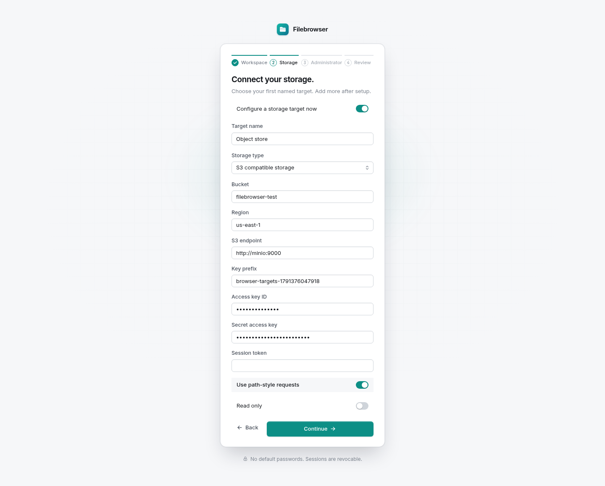
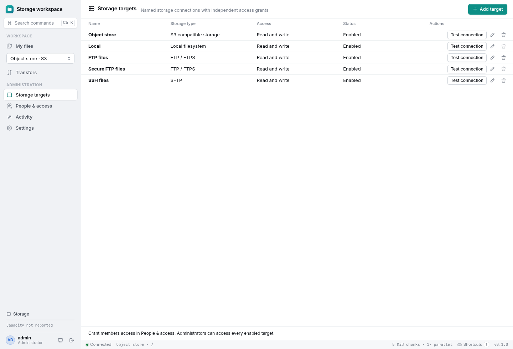
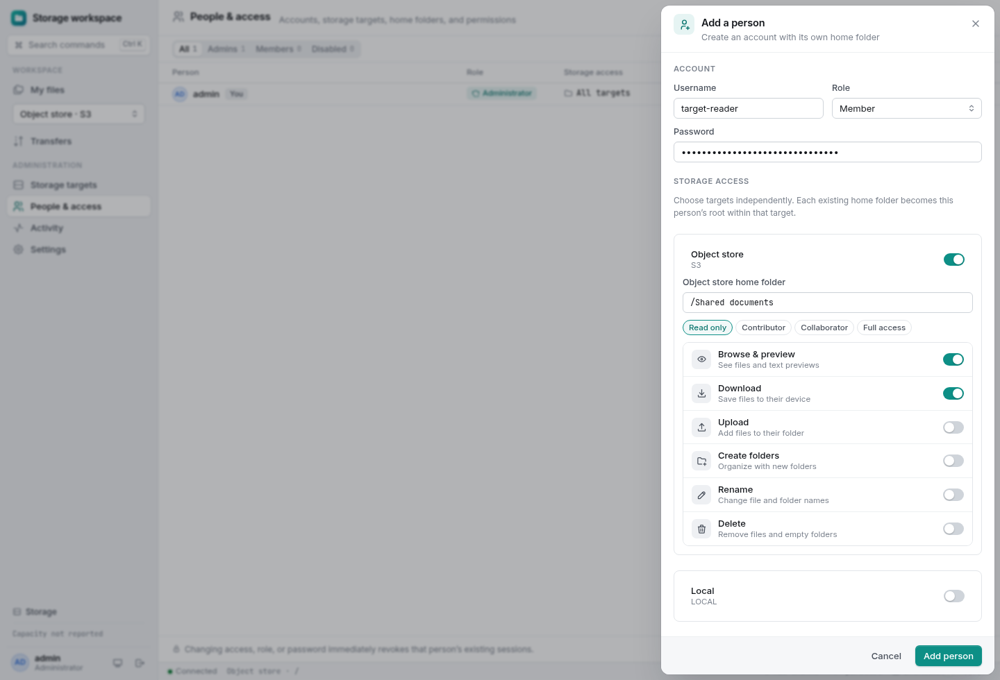
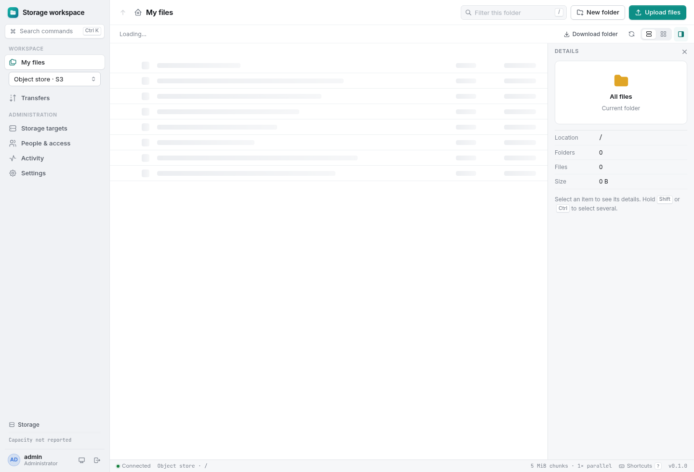
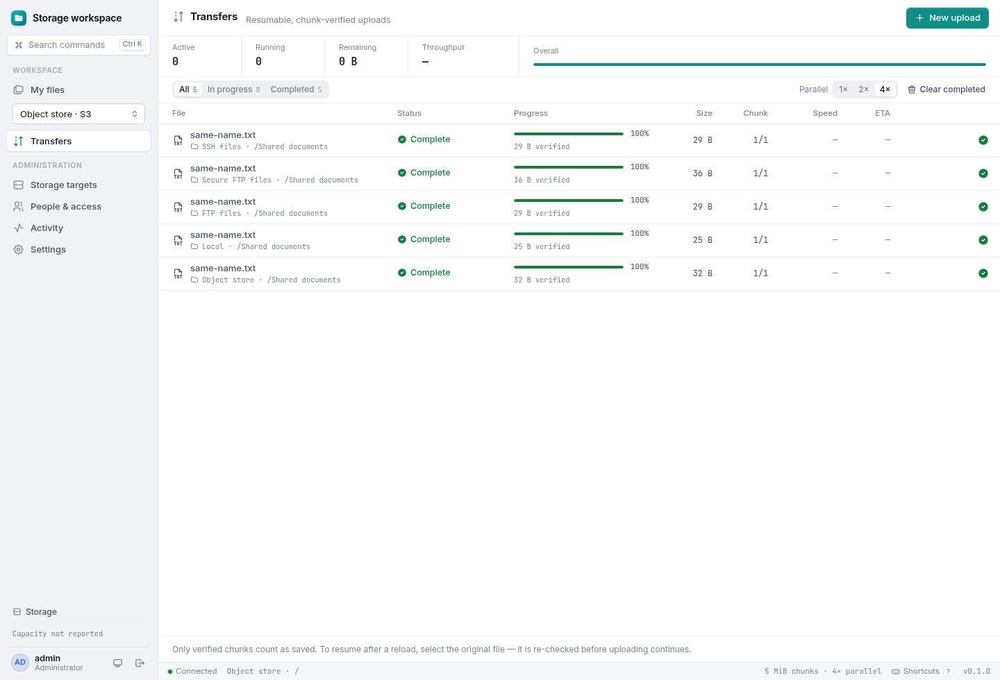
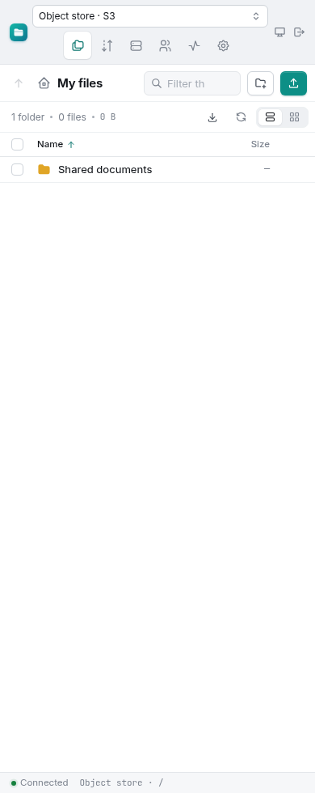
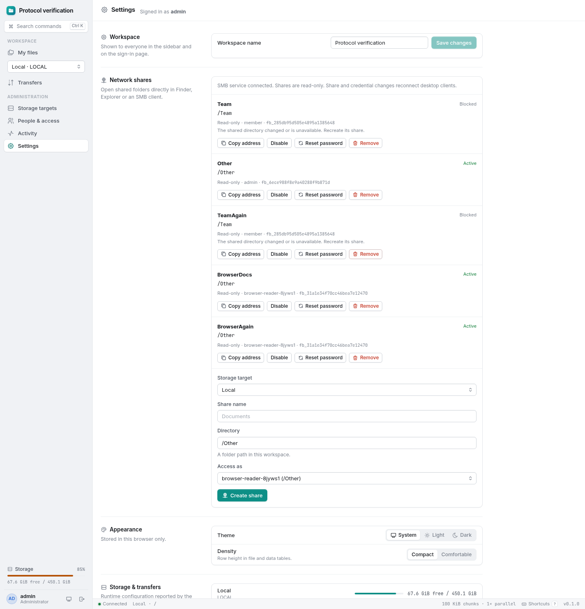

# Storage target verification

The subsequent [source cleanup review](cleanup-verification.md) records the latest 90-case container run. The 94-case baseline below includes four checks for the unused Prisma scaffold that has since been removed. The large-transfer and fault evidence remains applicable to the retained upload implementation.

Verified on Linux AMD64 on 2026-10-07 using isolated Docker Compose projects, Node.js 24, PostgreSQL 18, real tmpfs mounts, MinIO source revision `07c3a429bfed433e49018cb0f78a52145d4bedeb`, OpenSSH, plain FTP, certificate-verified vsftpd FTPS, Samba and Chromium 152.0.7977.54. All users, credentials, directories and files were disposable fixtures. No existing deployment or user data was used.

The application requires explicit named targets and per-target grants. The state format and API deliberately have no compatibility layer. The storage interfaces follow rclone's separation of operations and capabilities; the adapters use native TypeScript SDKs, and no rclone implementation was copied.

## Results

| Check | Result |
| --- | --- |
| Combined container lint, types, frontend/backend builds and Node suite | **94 passed, zero failures or skips**, including PostgreSQL, actual mounted filesystems and the remote services |
| Dedicated native remote suite | **25 passed, zero failures or skips**; these same tests are included in the combined count |
| Multi-target production browser workflow | **7 checks passed**, no page errors; S3-first setup, five connections, independent namespaces, upload/reload/resume, grants and responsive target switching |
| Chromium end-to-end workflow | **1 passed**; actual 101 MiB upload, worker hashing, interrupted chunk, reload, source verification, resume, scopes, file/TAR downloads and mobile controls |
| Local 1 GiB production upload | **19 checks passed**; 10,486 sequential 100 KiB chunks, SIGKILL/restart, full SHA-256, unchanged inode and bounded chunk staging |
| Real disk exhaustion | **4 checks passed**; 32 MiB tmpfs, 507 capacity denial, actual ENOSPC during append, rollback and successful byte-identical resume |
| Production API permission matrix | **16 checks passed** |
| Local browser setup/finish | **3 + 11 checks passed**, no page errors |
| Browser upload fault injection | **5 checks passed**, including lost acknowledgment, corrupt parallel part and whole-chunk retry |
| Browser layout and interactions | **11 checks passed**, including themes, grid/list, selection, keyboard controls, stale responses and mobile layout |
| Physically read-only container mount | **6 checks passed**, including administrator denials, ranges, HEAD, archives and account administration |
| Throughput layout regression | **21 measurements passed** at 1440, 768 and 390 pixels; speed stays on one line and the summary height stays fixed at each width |
| Native SMB3, application UID 1000 | **16 checks passed**, including two separate local targets and supplementary groups |
| Native SMB3, application UID 0 | **16 checks passed** with the same target isolation and revocation checks |
| SMB lifecycle/failure injection | **8 checks passed**; restarts, SIGKILL lease expiry, malformed/offline control, delayed/expired/superseded policies and control-write failure |
| SMB browser workflow | **5 checks passed**, no page errors; masked one-time credentials, ownership, controls and mobile layout |
| Portable distribution | Packaged runtime boots independently; dependency graph, notices, static assets and included deployment-document links verified |
| Dependency audit | **Zero reported vulnerabilities**, including development dependencies, at verification time |

The counts describe separate harnesses with overlapping coverage; they must not be added into a single unique-test count. The fixture compositions and commands are documented in [testing](testing.md).

## Target and permission assertions

Setup was exercised with an explicit Local target, an S3 target as the only first target, and no target at all. A failed local setup leaves no administrator or target and can be retried. The suggested local path is no longer disclosed anonymously after setup. Removed global filesystem environment variables, positional roots, unqualified upload manifests, old file endpoints and old databases are rejected rather than interpreted through compatibility code.

The browser creates Local, S3, FTP, FTPS and SFTP targets through their own configuration forms. It tests the connections, preserves a custom wizard target name, keeps saved secrets when edit fields are blank, and prevents changing a target's identity or location. Responses and audit records never contain connection secrets; the database stores encrypted connections and a separately protected encryption key.

Every target receives the same virtual folder and filename through real browser uploads. Native downloads return each target's own bytes, and route reloads retain the selected target. Active upload reservations, scoped homes, archives, pending names, metadata and history are independently qualified by target. The tests revoke grants and sessions, disable targets, apply read-only policy to retained uploads and reject cross-target reads or writes. Remote connection failures do not select an unrelated local directory or prevent other targets from being used.

Archive tickets retain their target and manager ownership, including concurrent initialization. Pending-ticket and active-stream budgets apply across all targets; changing targets cannot multiply a user's quota. Closing or editing one target releases only its own archives. Direct stream tests and concurrent HTTP ticket tests assert these boundaries.

Account revocation and edits to existing grants remain available when a target is disabled or offline. Only newly assigned or changed scopes require a filesystem probe. A regression reproduced the earlier 403 on account disabling and asserts both successful revocation and continued validation of a changed scope.

## Remote integrity and failures

For each remote protocol, the native suite transfers a 10 MiB + 193 byte payload in three chunks using four connections within a chunk. It rejects a later chunk before the current acknowledgment, corrupts an attempt, retries the entire chunk, restarts and resumes, verifies the complete SHA-256, tests byte ranges and HEAD, downloads an archive, moves/deletes a file, transfers an empty file and checks stage cleanup. Unicode and ordinary `.uploading`-suffixed filenames remain addressable; application-owned pending entries remain protected.

Each protocol is also killed after append, publication and cancellation. Recovery retains the acknowledged offset, avoids duplicate bytes and does not delete an already-published file. FTP and SFTP fixtures have acknowledged data deliberately truncated or changed without altering its length; recovery fails with data-loss detection before advancing progress.

An S3 upload also loses valid credentials after its first committed part. A subsequent request fails without advancing the checkpoint; the administrator can replace secret credentials while keeping the session, and resumption verifies the saved part and completes with matching bytes. Other connection settings remain locked while that transfer is retained.

Real proxy connections are cut during S3 and SFTP writes. The failed chunk returns a bounded error without changing the committed checkpoint, and a complete retry produces the expected bytes. Downloads are also cut and followed by a successful full download. Incorrect SFTP host identities are rejected. S3 directory prefixes containing private names, backslashes or control characters are excluded consistently.

Testing found and corrected an FTPS empty-stream handshake failure, an SFTP stream that could hang after disconnect, and a malformed JSON error response when a remote download failed before its first byte. SSH connections now disable Nagle buffering and reuse a bounded connection pool. Remote receipt files and their newly created parent directories are synced before acknowledging durable metadata.

## Large local transfer

The production server received **1,073,741,824 bytes** using a verification-only **102,400 byte** chunk override. It committed **10,486 chunks** in order. The host killed the application after **4,096 acknowledged chunks / 419,430,400 bytes** and restarted it against the same volumes. Recovery preserved that checkpoint and the payload inode.

The run deliberately replayed **42 successful commit requests** and used four connections for **106 chunks**. It also rejected corrupt, short and stalled sibling attempts and fenced expired tokens. The largest observed temporary chunk was **102,400 bytes**. Completion kept the same inode, removed the `.uploading` suffix, cleaned staging and refused to overwrite the final destination. The run took about **496 seconds**, including the controlled restart and concurrent build activity.

Full SHA-256:

```text
50a231f30de9bb7e2905a389f7f99a2d53d7e5be17981bcb3a83b4c6052b6644
```

A separate constrained filesystem failed during append at **16,588,800 acknowledged bytes**. Rollback retained that exact offset; freeing space allowed completion of a 20 MiB file with matching SHA-256. The suite also exercises real default-size 100 MiB streaming and validates a 200 GiB manifest without allocating that payload.

## SMB regression

Native clients access exports from two disjoint local targets. Disabling the second target denies its share while the first remains available. Existing scope checks, OS identity, supplementary groups, private-stage exclusions and account/password revocation remain enforced.

Packet inspection observed **18 encrypted SMB3 frames and zero plaintext file operations**. A real **257 MiB** partial download resumed to its full source SHA-256. The companion's file mounts remain read-only. Restart/fault checks run sequentially before browser controls so policy changes cannot interfere with unrelated assertions.

## Screenshots

These screenshots were captured from the tested production containers and show synthetic demonstration data.

S3 can be configured directly in the first-run wizard:



Five independently configured targets in the administration console:



Each user receives separate target grants and homes:



An S3 workspace has its own target-qualified route:



Transfers retain their target across interruption and reload:



The target picker remains usable on a narrow mobile viewport:



SMB exports still use target-specific local directory identities:



## Limits of this verification

A full 200 GB payload, physical power loss, faulty media and production credentials were not tested. S3 verification uses MinIO rather than the AWS service. Real FTP, FTPS and SFTP servers exercise protocol behavior, but cannot prove every other server's durability implementation.

FTP has no portable fsync or exclusive no-replace rename. SFTP requires OpenSSH fsync for acknowledged file data but cannot portably flush every remote parent directory. S3-compatible services must implement SHA-256 multipart checksums and conditional completion correctly; configure a lifecycle rule for untracked incomplete multipart uploads. S3 file rename is a bounded streaming copy followed by deletion, and directory rename is unsupported. Independent native writers must not race application-managed publication or rename. See [target capabilities](storage-targets.md) for the exact contracts.

The raw final logs, assertion JSON and screenshots are kept in an external verification archive. Generated logs, databases, keys and browser traces are excluded from the source release. No private target configuration is included.
