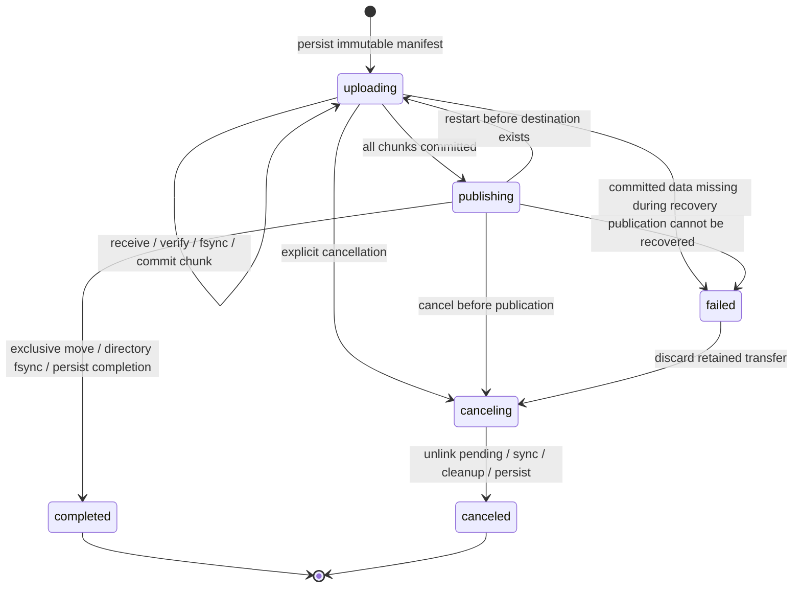

# Durable resumable upload protocol

## Assessment of the proposed design

Sequential 100 MiB chunks keep temporary disk use bounded and make recovery straightforward. A checksum manifest makes reselecting the wrong source file detectable. Restricting parallel connections to one chunk prevents a final full-file concatenation.

Three additions are necessary for robustness: an acknowledged offset must be durable, retried commits must be idempotent, and publication must recover from an uncertain response or crash. Checksums by themselves do not provide any of these guarantees.

The full initial scan is expensive. At 100 MiB/s, scanning 200 GiB takes about 34 minutes before network transfer starts; the file is then read again for upload. This implementation honors that upfront scan, uses a worker, reports progress, and limits read allocations to 4 MiB. It retains the manifest for pauses within the same browser. A new file selection after a reload is scanned again to prove it is the same content. Streaming hashes and initializing a session incrementally would reduce startup delay, but would change the requested manifest-first protocol.

## Invariants

1. Every session has an immutable file size, fixed per-session chunk size, ordered SHA-256 hash list, owner, canonical destination, and manifest identity. The default is 104,857,600 bytes; bounded environment overrides apply to new sessions. Resuming a stored session uses its original size.
2. Only `next_chunk` can start a new attempt. Chunk `N+1` cannot start until chunk `N` has a durable commit.
3. At most one attempt exists for the current chunk. Its random token fences old requests. A part has a fixed nonoverlapping offset and exact byte length. Parallelism is 1, 2, or 4 connections within this attempt.
4. An attempt is poisoned by a receive failure. Its sibling streams are closed and its entire temporary chunk is removed. A new attempt starts from byte zero of that chunk.
5. `committed_bytes` counts only verified bytes synced to the target and subsequently recorded in a FULL-synchronous SQLite transaction. Upload progress distinguishes sent bytes from committed bytes.
6. An acknowledged commit cannot be undone by a later retry. A commit for an earlier index returns the existing session state without appending again.
7. A staging target's valid prefix ends exactly at `committed_bytes`. Recovery truncates a longer target and fails visibly if committed bytes are missing.
8. The pending name `filename.uploading` is visible from initialization; the final name appears only after every expected chunk has committed. Both names are reserved. Pending files are labeled and cannot be read or mutated through the file API. Publication fails if an unrelated destination already exists.

## State machine



Per-chunk attempts are deliberately ephemeral. A server restart destroys the attempt but preserves the session's committed prefix. A missing attempt means retry the whole current chunk.

## HTTP operations

All endpoints require an authenticated cookie session and a session owned by that user. Write requests require `X-Filebrowser-Request: 1` and same-origin verification. Upload write operations recheck upload permission and the user's current folder scope. Session IDs and attempt IDs are UUIDs.

| Endpoint | Result |
| --- | --- |
| `POST /api/uploads` | Validate the complete manifest; reserve the destination; create private staging anchor, persist the session, then expose its `.uploading` name. A matching active manifest for the same owner/destination returns the existing session. |
| `GET /api/uploads` | List the user's recent transfer records. |
| `GET /api/uploads/:id` | Read authoritative status, next chunk, committed offset, and manifest hash. |
| `POST /api/uploads/:id/chunks/:index/start` | Create a fresh attempt with `{connections: 1 \| 2 \| 4}`; return token and part offsets/sizes. A previously committed index returns the existing commit. |
| `PUT /api/uploads/:id/attempts/:attempt/parts/:part` | Stream exactly the assigned part as `application/octet-stream` into the single chunk file, with disk backpressure. |
| `POST /api/uploads/:id/chunks/:index/commit` | Receive `{attemptId}`; require every part; hash the chunk on disk; append; sync; commit the offset; delete chunk; acknowledge. |
| `POST /api/uploads/:id/complete` | Publish the fully committed target, sync its directory, record completion, and remove staging. Idempotent after completion. |
| `DELETE /api/uploads/:id` | Persist `canceling`, discard the owned pending name and staging data, then persist `canceled`. Startup retries interrupted cleanup. A published file cannot be canceled. |

The manifest contains `{name, directory, size, lastModified, chunkSize, hashes}`. `directory` is relative to the user's home folder. Hashes are lowercase SHA-256 hex strings. The canonical manifest hash is SHA-256 of UTF-8 `JSON.stringify({version:1,size,chunkSize,hashes})`. Modification time is informational and is not accepted as proof of file identity.

## Commit ordering

```text
receive fixed parts into chunk file
    ↓
SHA-256(chunk on disk) == manifest[index]
    ↓
append chunk at committed_bytes, never at an unverified offset
    ↓
fsync(target)
    ↓
SQLite UPDATE(next_chunk, committed_bytes), synchronous=FULL
    ↓
discard temporary chunk
    ↓
send acknowledgment
```

The first target, destination marker, and containing staging directories are synced before session initialization commits. Only afterward is a public `filename.uploading` hard link created and its parent synced. The private `target.uploading` anchor shares the same inode and blocks. Startup migrates legacy `target` names in place and restores missing pending aliases without copying data. Disk writes handle partial writes and apply backpressure. A checksum/append failure truncates the target to its previous durable offset. Temporary chunks are not made durable because they can be reconstructed from the source after a crash.

For a destination on another mounted filesystem, the payload and chunk live in a private `.filebrowser-uploads-<device>` directory on that filesystem. The central `.filebrowser-uploads/<session>` registry is a private symlink to that stage; it is durably written before payload creation and removed after payload cleanup. Public file APIs still reject all symlinks and reserved paths. This keeps the anchor, pending name and final name on one device without copying the completed file. Capacity checks use the destination filesystem. Recovery validates the recorded device and retains the registry and destination reservation if the mount is unavailable; such a session is marked failed and can be inspected or canceled after restoring the mount.

## Failure cases

| Failure | Recovery |
| --- | --- |
| Network drop or part length mismatch | Poison attempt, close sibling connections, delete the whole chunk, retry with a fresh token. |
| Retry races with canceled writers | Return `UPLOAD_BUSY` until every old writer has closed; a retry never deletes or writes into a newer attempt. |
| Chunk checksum mismatch | Discard chunk and leave durable offset unchanged. |
| Crash before append completes | Truncate the partial appended tail to the database offset on restart. |
| Crash after target sync but before metadata commit | Truncate the uncommitted tail; re-upload the chunk. |
| Metadata committed but response lost | Query session status or repeat commit; bytes are not appended twice. |
| Crash during publication | Persist `publishing` before moving the pending name. Exclusive link + destination-directory sync precede unlink + source-directory sync. If both names exist after a crash, verify the final inode/size, remove only the owned pending name, sync, and complete. The private anchor remains until completion is durable. |
| Crash during cancellation | Persist `canceling` before unlinking the pending name. Repeat cleanup and persist `canceled` on restart, even if the private stage has already disappeared. |
| Pending filename collision | Reserve both names; reject another transfer or file operation targeting either name. Cancel removes only an alias matching the stored inode, preserving unrelated replacements. |
| Disk full | Stop and retain committed prefix. Free space, then resume. An append error rolls back its uncommitted tail. |
| Browser reload | List sessions, select original file, verify the entire manifest, resume from the server's next chunk. |
| Incorrect source selected | Reject its manifest before uploading further bytes. |
| Permission or scope revoked | Reject new upload writes and revoke cookie sessions. Existing committed data remains retained. |
| Second application process | Reject it using OS-managed SQLite exclusive locks on both state and storage root. |
| Previously committed bytes missing on disk | Mark transfer failed; do not claim success or append after a gap. Preserve staging for inspection/cancellation. |

Transient failures use exponential backoff with jitter, capped near 30 seconds; the browser checks server status before retrying. After eight consecutive retries it stops and preserves progress. A manual resume is available. Unauthorized, missing-session, permission, and disk-full errors stop automatically.

## Disk and memory bounds

For each active session, the server stores the growing target and at most one chunk file of 100 MiB. Up to four part streams write into that one file; there are no four separate 100 MiB buffers. Appending temporarily duplicates the current chunk's blocks between the growing target and chunk file, with a peak bound of final target size plus one chunk. The private anchor and visible pending name share one inode. Finalization exclusively moves the pending name to the final name and removes the private anchor after durable completion; it allocates no second full file. Its link/unlink move briefly permits both public names, so `atomicMove` is false. For original names over 245 UTF-8 bytes, the pending basename is truncated on character boundaries and gains a deterministic 16-hex-character hash before `.uploading`, keeping it within 255 bytes. A completed file ending in `.uploading` is ordinary; database ownership, rather than the suffix alone, identifies unfinished files.

The browser hashes through 4 MiB buffers and sends Blob slices. The server reads/writes streams and copies with 1 MiB buffers. Actual browser/network runtime buffering is implementation dependent, but neither application reads a 200 GiB file into memory. Metadata is proportional to the chunk count: 2,048 SHA-256 hashes for 200 GiB. Immutable manifests use a bounded eight-entry LRU; each part request reads current ownership and status from SQLite without repeatedly parsing the full hash list. At most 64 initialized, unfinished sessions are allowed globally. Temporary disk bounds are per session.

`FB_UPLOAD_CHUNK_SIZE` accepts 64 KiB through 100 MiB. `FB_MAX_FILE_SIZE` must fit within 12,000 chunks and 1 TiB. With the 100 KiB verification override, a 1 GiB file uses 10,486 sequential chunks. This stresses commit count and recovery while keeping individual fault retries inexpensive. The runtime limits are advertised to the browser, and a session's stored chunk size survives configuration changes.

## Storage abstraction

The [rclone filesystem interface](https://github.com/rclone/rclone/blob/master/fs/types.go) separates filesystem operations, objects, and optional backend features. This application's `StorageBackend` similarly provides listing, stat, range reads, mkdir, move, remove, capacity reporting, and capability flags. `SequentialUploadBackend` separately expresses staging, rollback, part writes, integrity checks, append, and exclusive publication.

This is a TypeScript contract informed by rclone, not a direct implementation of its Go ABI. A future rclone bridge can wrap remote control or a Go sidecar. Object stores generally require multipart upload and different commit/publication semantics; an adapter must explicitly satisfy these invariants. The app currently constructs only the local implementation.

## Assumptions and validation limits

The guarantees assume a local filesystem and hardware that honor `fsync` and SQLite file locks. They do not repair a drive that silently loses acknowledged writes, faulty RAM, or unrelated host processes that replace directory entries concurrently. Symlinks are rejected and file opens use `O_NOFOLLOW`, but protection against hostile concurrent host directory replacement requires OS-level directory ownership/sandboxing; Node's portable APIs do not expose every `openat`/`renameat2` confinement primitive. Local publication depends on same-volume hard links.

Chunk SHA-256 detects transport and staged-data errors before commit. There is no additional full-file checksum sent by the client: the immutable size and ordered chunk hashes define the file. Committed data is not continuously rehashed for later disk bit rot. Filesystem checksumming, backups, and hardware protection are separate layers.

Tests exercise actual 100 MiB streaming with multiple connections, a second sequential chunk, TCP interruption, corrupt data, replayed acknowledgments, rollback, missing committed bytes, and SIGKILL at both durable transitions. The browser test verifies a 101 MiB upload across a reload with matching final bytes. Additional production-container harnesses exercise a 1 GiB transfer with 100 KiB chunks, server SIGKILL mid-transfer, real filesystem exhaustion and resumption, and a browser reload with an incorrect source followed by the correct one. See [the testing guide](testing.md) to reproduce these checks with disposable fixtures. A 200 GiB session manifest and 64-bit-sized metadata are tested; a full 200 GB transfer and physical power-loss testing remain to be done on suitable deployment hardware.
