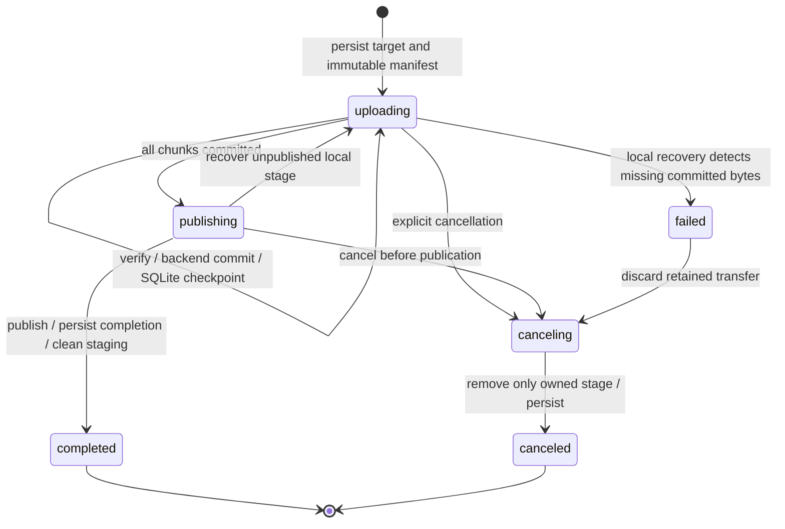

# Resumable upload protocol

Uploads identify a target and destination, scan the entire source in a browser worker, and initialize an immutable ordered SHA-256 manifest before sending any bytes. The default chunk is 100 MiB. Chunks commit sequentially; only the current chunk may have 1, 2 or 4 connections. The browser reads through 4 MiB buffers and sends Blob slices. Server part streams write disjoint offsets into one bounded temporary chunk with backpressure.

## Invariants

1. A manifest contains `{targetId,name,directory,size,lastModified,chunkSize,hashes}`. Directory paths are relative to that user's grant on that target. Manifest content hash is SHA-256 of `JSON.stringify({version:1,size,chunkSize,hashes})`; the destination and target are separately immutable session identity.
2. Target identity qualifies reservations and every stored path. Both the final name and its `.uploading` pending name are reserved. Identical paths in other targets are independent.
3. `next_chunk` identifies the sole allowed uncommitted chunk. Chunk N+1 cannot start before chunk N has committed. Only one ephemeral attempt exists for that chunk.
4. An attempt has a random fencing token and fixed nonoverlapping part offsets and exact lengths. A failed receive poisons the attempt, closes sibling streams, and discards the entire temporary chunk. Retries start the chunk from byte zero.
5. SHA-256 of the staged chunk must match its manifest entry before the storage adapter sees it. Each adapter must verify or obtain checksum acknowledgment for remotely stored bytes.
6. `committed_bytes` advances only after the adapter's commit receipt and then a FULL-synchronous SQLite update. Lost responses and repeated earlier commits return saved progress without appending twice.
7. Resume validates saved identity and the committed checkpoint. Unacknowledged local/SFTP tails are truncated; S3 replaces the unacknowledged part; FTP overwrites its hidden tail at the saved offset. Missing or corrupt committed data fails visibly with `DATA_LOSS` and never advances progress.
8. Publication starts only after all chunks commit. It does not concatenate a full local file or allocate a second full upload payload. The final name appears after publication; the pending entry disappears. A completed name ending in `.uploading` is an ordinary file identified by database ownership, not its suffix.

## State machine

Attempts are ephemeral; sessions and their committed prefixes survive process restarts. Local recovery runs at startup. Remote recovery happens when the session resumes, completes or cancels, so an offline remote cannot prevent unrelated targets starting. A publishing session reconciles a lost publication acknowledgment before trying again. The backend proves its own published file's identity; it never cancels by deleting an unrelated final file.

## HTTP operations

All endpoints require an authenticated cookie session and a session owned by that user. Write requests require `X-Filebrowser-Request: 1` and same-origin verification. The server refreshes the user's grant, target enabled/read-only state and scope for upload writes, streamed parts and commit acknowledgment. Session and attempt IDs are UUIDs.

| Endpoint | Behavior |
| --- | --- |
| `POST /api/uploads` | Validate the complete target-qualified manifest and backend multipart limits; reserve both names; create owned staging and persist the session. A matching active manifest for the same owner/target/destination returns that session. |
| `GET /api/uploads` | List the user's transfer records with target IDs. |
| `GET /api/uploads/:id` | Return authoritative status, next chunk, committed offset and manifest hash. |
| `POST /api/uploads/:id/chunks/:index/start` | Accept `{connections:1\|2\|4}`; reconcile the saved stage; create a fresh attempt and return its token and part assignments. |
| `PUT /api/uploads/:id/attempts/:attempt/parts/:part` | Stream the exact assigned part as `application/octet-stream`; never buffer an entire file. |
| `POST /api/uploads/:id/chunks/:index/commit` | Accept `{attemptId}`; require all parts; verify the entire chunk; commit through the adapter; persist the checkpoint; discard the chunk; acknowledge. |
| `POST /api/uploads/:id/complete` | Persist publishing, publish the saved payload, persist completion and clean staging. Idempotent after completion. |
| `DELETE /api/uploads/:id` | Persist canceling, remove owned pending data and staging, then persist canceled. Retry interrupted cleanup. Published files cannot be canceled. |

## Backend commit and publication

| Backend | Verified chunk commit | Finalization |
| --- | --- | --- |
| Local | Append at `committed_bytes`, handle partial writes, fsync target; SQLite FULL checkpoint | Exclusive hard link of the same inode, fsync destination directory, unlink pending name, fsync source directory; retained private anchor proves ownership across crashes |
| S3 | UploadPart with SHA-256, require matching checksum acknowledgment; fsync a receipt containing upload ID, part number, checksum, ETag and end offset | Conditional CompleteMultipartUpload (`If-None-Match: *`), no whole-file local staging; upload metadata identifies a successfully completed object after a lost ACK |
| SFTP | Offset write to owned private payload, require OpenSSH fsync extension, read back the chunk and compare SHA-256, fsync receipt | SFTP rename of the private payload after destination checks; a lost ACK is reconciled by comparing every saved chunk hash against final contents |
| FTP/FTPS | Require REST STREAM; REST+STOR at saved offset; read back and verify the chunk, fsync local receipt | Verify all saved bytes before rename; no portable remote fsync or atomic no-replace rename |

For local destinations on another mounted filesystem, the payload and current chunk live in a private `.filebrowser-uploads-<device>` directory there. A durable central registry identifies that stage. Anchor, pending alias and final file share one device and inode. Capacity checks use that destination filesystem. Missing mounts retain the reservation and staging identity rather than creating replacement data on the wrong device.

Remote adapters keep receipt metadata and one temporary chunk in the private state directory. They never stage the entire remote file locally. S3 validates the committed multipart parts' checksums, sizes and ETags on resume. FTP/SFTP validate the committed prefix after app restart/reconnect; this can reread a large prefix and costs network traffic without another full-file allocation. SFTP caches a bounded set of authenticated connections with pinned host identity and closes them on target reconfiguration or shutdown. Connection loss during a write explicitly terminates the pending operation so it cannot hang waiting for an SDK stream callback.

The browser's pending `.uploading` entries are virtual for remote targets. Native S3 clients see no object until multipart completion. Native FTP/SFTP clients can see an owned private `.filebrowser-upload-<session>/payload.uploading` stage, but app file APIs reject those reserved directories. Local targets expose a hard-link alias with the public pending name.

## Failure handling

| Failure | Result |
| --- | --- |
| Receive interruption, length mismatch or corrupted part | Poison and discard whole attempt; close siblings; checkpoint unchanged. |
| Backend connection lost during write | Return a retryable storage error; reset to acknowledged progress; retry the complete chunk. |
| Crash after backend append/part receipt but before SQLite checkpoint | Reset unacknowledged state and replay that chunk. |
| SQLite committed but ACK lost | Query progress or repeat commit; no duplicate bytes. |
| Crash during publication | Reconcile owned final identity/checksums; finish without overwriting or deleting unrelated final data. |
| Crash during cancellation | Retry cleanup of the owned stage; retain reservation until cleanup completes. |
| Existing final name | Preserve transfer and report destination conflict; FTP requires no competing external publication writer. |
| Local ENOSPC/EDQUOT | Roll back current append, retain committed prefix and return 507; free space and resume. |
| Browser reload or original source no longer held | Select the original file, scan the full manifest again, then resume on the saved target. A different source is rejected. |
| Grant, scope, target access or account revoked | Reject new writes and commit acknowledgment; retain saved progress. Account grant changes revoke cookie sessions and active receive attempts. |
| Saved committed data truncated or corrupted | Report data loss and stop; preserve state for inspection/cancellation. |

Transient failures use exponential backoff with jitter, capped near 30 seconds. The browser checks authoritative progress before retrying, then pauses after eight consecutive retries. Unauthorized, permission, missing-session, data-loss and disk-full errors stop automatically. Manual resume is available. A stalled old writer must close before a new attempt starts; fencing prevents it from corrupting a newer chunk.

## Bounds and limits

Temporary payload space is at most one chunk per active session in addition to the growing destination. Parts share that file rather than allocating individual chunk copies. Finalization does not create a second full local payload. Application buffers are bounded; runtime/network buffering varies. Metadata is proportional to the manifest length. A 200 GiB file uses 2,048 hashes with the default 100 MiB chunk. Up to 64 initialized unfinished sessions are allowed globally.

The general maximum is 1 TiB and 12,000 chunks. S3 additionally caps uploads at 10,000 parts and requires multipart chunks of at least 5 MiB except the last. The frontend checks target limits before hashing; the server checks them independently. `FB_UPLOAD_CHUNK_SIZE` accepts 64 KiB through 100 MiB. Existing sessions retain their saved chunk size after configuration changes. A 100 KiB override exercises 10,486 sequential chunks for a 1 GiB local file; remote tests use 5 MiB chunks to satisfy native S3 rules.

Original names over 245 UTF-8 bytes gain a truncated public pending basename and deterministic 16-hex hash before `.uploading`, staying within 255 bytes. Private names, symlinks, traversal, special files and unsupported control/backslash names remain inaccessible through normal file APIs.

## Guarantees and validation limits

The adapter contract separates filesystem operations, optional capabilities and sequential upload operations, informed by [rclone's Fs/Object/Features interfaces](https://github.com/rclone/rclone/blob/master/fs/types.go). It is a TypeScript abstraction with native SDK adapters; no rclone implementation is distributed. See [target capabilities](storage-targets.md) for connection, read-only, remote failure and native export semantics.

Local guarantees assume working file/directory fsync and SQLite locks. SFTP requires file fsync but standard SFTP cannot request every parent-directory flush. S3-compatible services must honor checksum and conditional publication semantics. FTP cannot guarantee durable remote flushes or exclusive publication and is explicitly advertised as weaker. Hardware that loses acknowledged writes, hostile host processes replacing directories and physical power loss beyond storage guarantees are outside these contracts. Local committed bytes are not continually rehashed for later disk bit rot.

Verification includes real protocol servers, SHA-256 rollback, interrupted remote writes, saved remote corruption/truncation, process SIGKILL during append/publication/cancellation, real 100 MiB streaming, browser reloads, mounted filesystem staging, a 1 GiB/10,486-chunk local transfer, actual ENOSPC and 200 GiB manifests. A full 200 GB payload and physical power-loss tests have not been performed. See [testing](testing.md) and [the current verification report](storage-targets-verification.md).
