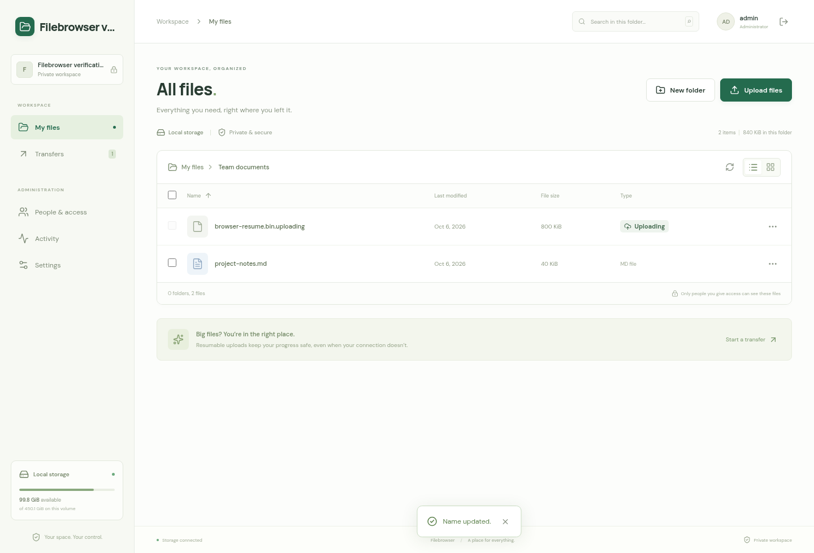
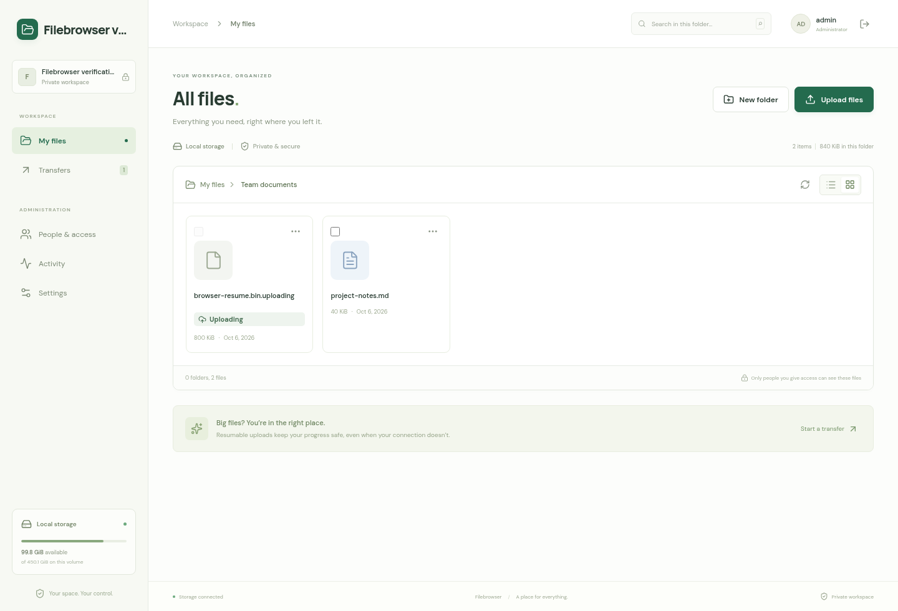
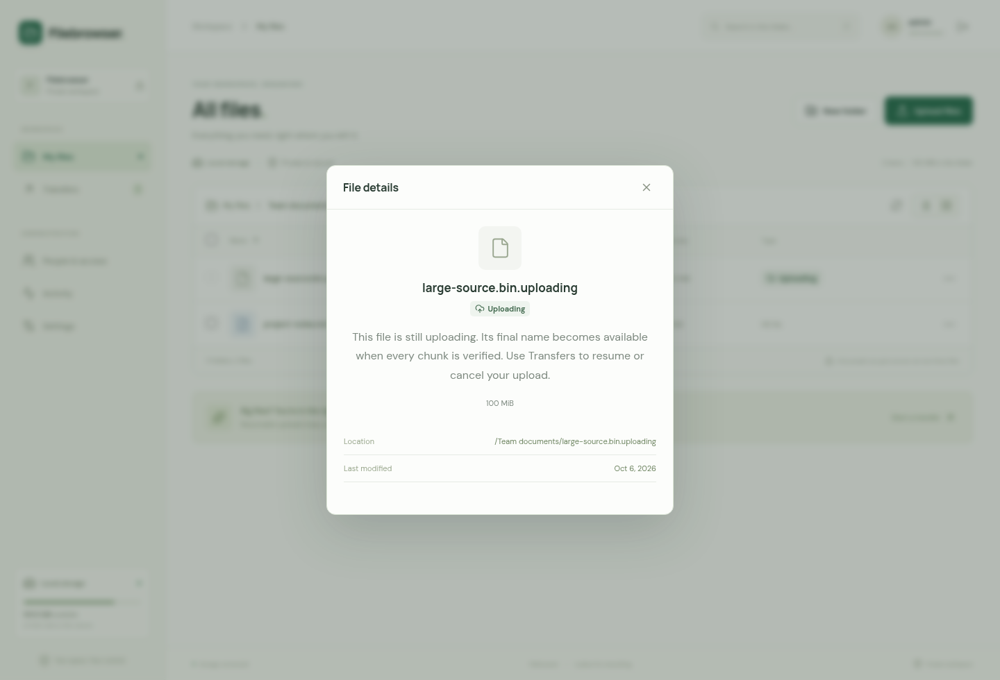
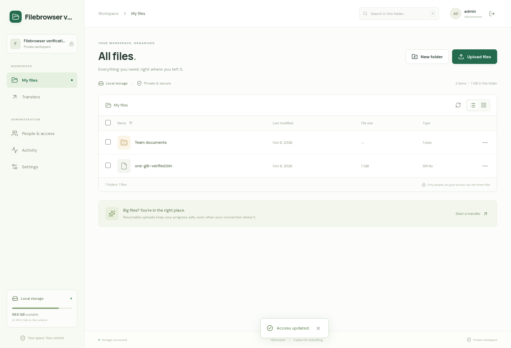
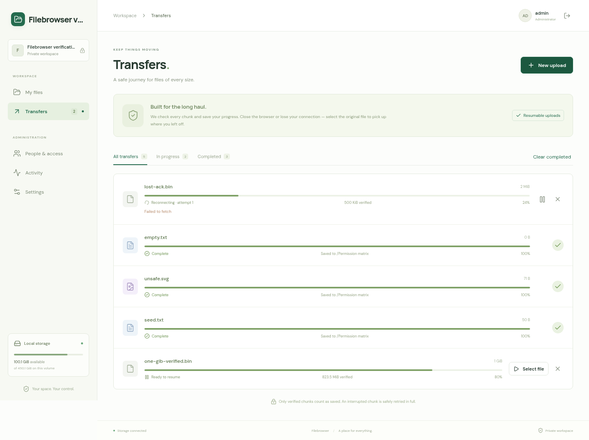
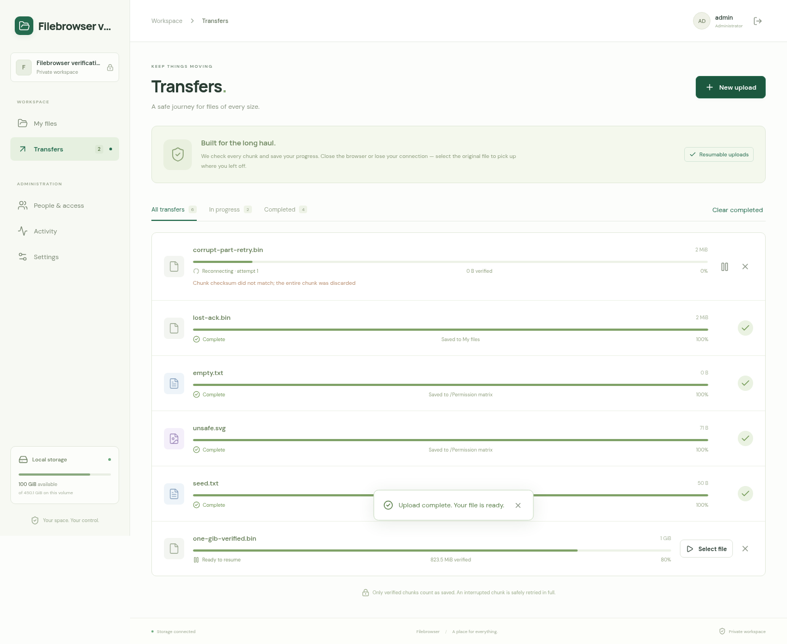
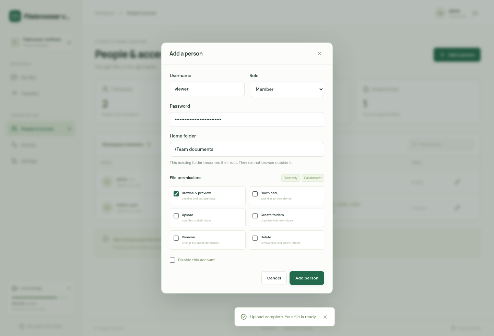
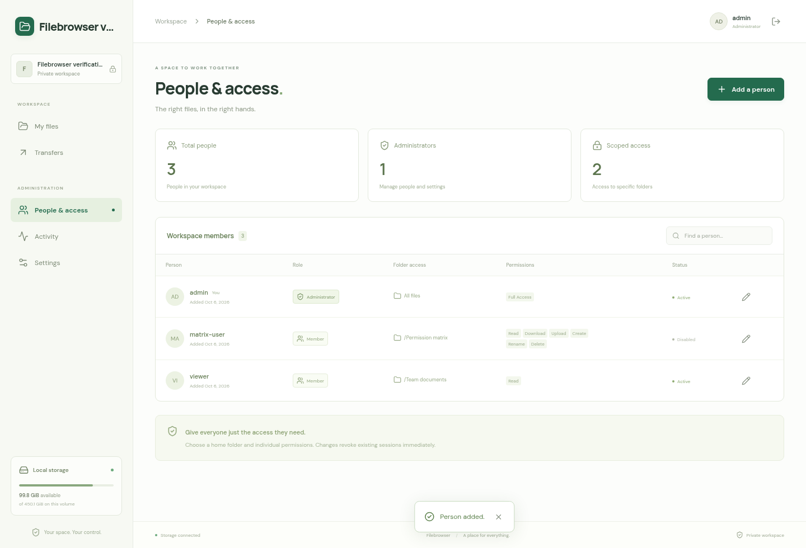

# Filebrowser verification report — visible .uploading files

**Result: PASS.** The requested pending-file suffix is implemented and verified locally in containers on 6 October 2026. An upload to `example.bin` appears as `example.bin.uploading`. Completion moves the same inode to `example.bin`, removes the suffix and private anchor, and performs no full-file copy or concatenation.

The final container suite passed **32 tests, zero failures, zero skips**. A fresh **1 GiB transfer across 10,486 sequential 100 KiB chunks** survived a production-server SIGKILL at 400 MiB and matched its expected whole-file SHA-256. The browser also exercised the default **100 MiB chunk** configuration with a 101 MiB file. There are **35 screenshots from successful current runs**, plus eight retained screenshots from earlier harness attempts. [The previous verification report](REPORT-before-uploading-suffix.md) and its original evidence are preserved as a baseline; all results below concern the suffix implementation.

A complete 200 GB transfer and physical power-loss or faulty-hardware tests have not been performed. A 200 GiB manifest is validated by the automated suite.

## Implemented behavior

- The growing destination has a visible `.uploading` name beside its eventual final name. The private `target.uploading` anchor is a hard link to the same inode and consumes no second copy of the payload. One bounded temporary chunk remains the only duplicate payload storage.
- File lists and grids mark pending files “Uploading.” Their displayed size counts acknowledged, committed bytes. Their checkboxes are disabled; select-all excludes them. Details explain their status and expose no download, preview, rename, or delete actions.
- The server rejects reads and file mutations of pending files, including direct API requests. It also protects the intended final name and parent directories, preventing rename/delete from invalidating a transfer. Failed and canceling sessions retain their reservations until cleanup.
- Completion persists `publishing`, exclusively creates the final name, syncs its directory, unlinks the pending name, syncs again, and persists completion. Only then is the private anchor removed. This same-filesystem move uses link/unlink to avoid the overwrite behavior of ordinary POSIX rename. It briefly permits both names while always exposing complete bytes; the backend therefore advertises `atomicMove: false`.
- Startup recognizes an already-published inode and completes an interrupted move, removing only the pending alias belonging to that upload. Missing pending aliases can be restored from the private anchor. Legacy private `target` files migrate in place without re-uploading or copying data.
- Cancellation persists `canceling` before cleanup and `canceled` afterward. Startup retries interrupted cancellation even when the private stage has already disappeared. An unrelated host-side replacement at the pending name is preserved.
- Ordinary completed filenames ending in `.uploading` remain usable. For original names over 245 UTF-8 bytes, a shortened basename plus a deterministic hash and `.uploading` fits within 255 bytes. Tests cover a 255-byte Unicode filename.







## Environment and provenance

| Item | Value |
| --- | --- |
| Starter | `KevinWang15/ts-fullstack-starter`, commit `260e5a088d8abeb6dbd2289f05d224cbe9f78ff8` |
| Host | Linux `6.8.0-142-generic`, x86-64 |
| Docker / Compose | `29.1.3` / `2.40.3+ds1-0ubuntu1~24.04.1` |
| Container Node / npm | `v24.21.0` / `11.19.0` |
| Browser | `Google Chrome for Testing 152.0.7977.54` through Playwright |
| Optional starter database | PostgreSQL `18.6`, isolated fixture |
| Runtime service account | `node`, uid/gid 1000 |
| Persistence | Separate files/state volumes; SQLite WAL and FULL-synchronous commits |
| Stress configuration | `FB_UPLOAD_CHUNK_SIZE=102400`; max 12,000 chunks |
| Production default | 104,857,600 bytes = 100 MiB |
| Disk-pressure fixture | 32 MiB files tmpfs; separate 16 MiB state tmpfs |
| Browser viewports | 1440 × 980 desktop; 390 × 844 mobile |

[Environment, image identities and source digests](uploading-suffix/environment.json) identify the tested application. The production app and disk-pressure app had the same server bundle SHA-256:

```text
7cc5e3e7d0a57e0ea37026fe4880cb9484d7646039e4f81223218405834b7030
```

Tests used only the dedicated `filebrowser-verify` Compose project and disposable test directories. The runner inspected the production file volume through a read-only mount. The user's development workspace was left ready for first-run setup. Verification containers were stopped after collection; their fixture volumes were retained.

## Verification matrix

| Area | Result | Evidence |
| --- | --- | --- |
| Lint, TypeScript, production frontend/server builds | PASS | [Container check](uploading-suffix/logs/container-check.log), [final lint](uploading-suffix/logs/final-lint.log), [workspace build](uploading-suffix/logs/workspace-build.log) |
| Backend, storage, recovery, production packaging, starter and PostgreSQL tests | 32 passed; 0 failed; 0 skipped | [Container check](uploading-suffix/logs/container-check.log) |
| Default 100 MiB chunk and 101 MiB browser upload | PASS | [Browser log](uploading-suffix/logs/default-e2e-final.log), [browser evidence](uploading-suffix/default-e2e-final/filebrowser-setup-file-ope-aec1f-ped-users-and-mobile-layout/validation.txt) |
| Production 1 GiB transfer with 100 KiB override | PASS | [Transfer results](uploading-suffix/large-upload-results.json), [log](uploading-suffix/logs/large-upload.log) |
| Production SIGKILL/restart and memory sampling | PASS | [Fault injection](uploading-suffix/fault-injection-results.json), [samples](uploading-suffix/container-resource-samples.json) |
| Capacity guard and actual ENOSPC during append | PASS | [Disk results](uploading-suffix/disk-results.json), [log](uploading-suffix/logs/disk-pressure.log) |
| Authentication, scopes and all six permissions independently | PASS, 16 checks | [API results](uploading-suffix/api-results.json) |
| Production setup wizard | PASS, 3 checks | [Setup results](uploading-suffix/browser-setup-results.json) |
| Production file UI, pending markers, reload/resume, users and mobile | PASS, 11 checks | [Browser results](uploading-suffix/browser-finish-results.json) |
| Lost successful commit response, corrupted parallel part, pause/resume and cancellation | PASS, 5 checks | [Browser fault results](uploading-suffix/browser-fault-results.json) |
| Final file has one link; suffix and staging are gone | PASS | [Filesystem state](uploading-suffix/final-filesystem-state.json) |

## Large-transfer assertions

| Measurement | Observed value |
| --- | --- |
| File size | 1,073,741,824 bytes = 1 GiB |
| Chunk count / size | 10,486 / 102,400 bytes |
| Final chunk | 77,824 bytes |
| Transfer and final verification duration | 352.8 seconds, including restart |
| Four-connection chunks | 106 |
| Replayed successful commits | 42; no duplicated append |
| Largest observed temporary chunk | 102,400 bytes |
| Kill checkpoint | 4,096 chunks; 419,430,400 acknowledged bytes = 400 MiB |
| Host process across kill | `2575387` → `2607506` |
| Inode across pending name, restart and final name | `3772030` |
| Final hard-link count | 1; private anchor and pending name removed |
| Resource samples | 182 |
| Sampled production memory | 48.75–168.30 MiB; this run, not a universal ceiling |

The expected and actual full-file SHA-256 matched:

```text
50a231f30de9bb7e2905a389f7f99a2d53d7e5be17981bcb3a83b4c6052b6644
```

The manifest contained distinct content per chunk. The harness asserted strict ordering, rejected a future chunk, checked stale attempt tokens, corrupted a parallel chunk, submitted a short part, and verified that a failed part closed a stalled sibling. Successful commits were replayed every 251 chunks. Pending-file inode and byte length were checked at those checkpoints and after restart. The final file retained that inode, the suffix disappeared, staging was empty, existing destinations could not be overwritten, and a byte range from chunk 2,048 matched the expected distinct source bytes.

The override executes approximately 5.12 times as many commits as a 200 GiB upload using 100 MiB chunks. Separate HTTP and browser tests cover the actual default chunk size rather than relying only on the small override.



## Crash, disk and browser recovery

Subprocess tests use SIGKILL at four exact boundaries: after append/fsync but before the offset transaction, after creating and syncing the final link while both public names exist, after removing the pending name but before recording completion, and after cancellation cleanup but before recording `canceled`. Restart either truncates the uncommitted tail, recognizes and finishes the publication, or finishes cancellation. No committed bytes are duplicated or silently skipped.

Further storage tests cover missing committed bytes failing visibly, legacy stage migration, restoring a missing public alias, orphan cleanup, a torn initialization marker, preservation of a completed file subsequently renamed to a suffix name with the old inode, pending-name collisions, cancellation of replaced aliases, idempotent cancellation, and long Unicode names.

The 32 MiB disk fixture first hit the capacity guard at **16,588,800 committed bytes** and retained that offset. The host then filled the filesystem to actual ENOSPC with **zero available bytes**. Appending the staged chunk returned HTTP 507 and rolled back the entire chunk. After freeing space, the 20 MiB file completed with SHA-256 `386e98830b84502a4e7325c9bc2b05de23c054bb896f2ed9b9e3edfd7ab91562`.

The production browser resumed a 12 MiB transfer after interruption at chunk 8, reload, rejection of a same-size wrong source, and reselection of the correct source. Pending files were labeled in list/grid views, could not be selected, and exposed no download or rename action. Additional browser routing faults discarded a successful commit response and flipped one byte in a parallel part; the browser queried the durable offset or retried the whole chunk and completed with matching bytes. Pause/resume reused a single hashing worker and manifest. Canceling after four committed chunks removed both staging and the visible suffix.





## Setup and administration

The browser creates the first administrator through the setup wizard and verifies setup is subsequently locked. Tests exercise folder creation, list/grid layouts, previews, byte-identical downloads, rename, empty files, range downloads, scoped users, traversal/symlink/reserved-path rejection, CSRF, every permission independently, session revocation on permission/password/disable changes, and protection of the last enabled administrator. The 390-pixel mobile viewport has no page overflow. Successful browser runs recorded no unhandled JavaScript errors.





## Harness corrections and remaining limits

The first new default-browser assertion looked for the final filename in the root folder after reload, although the upload belonged to `/Team documents`. The test was corrected to reopen that folder; the complete rerun passed. Its original [failure log](uploading-suffix/logs/default-e2e.log) and diagnostic trace remain in `uploading-suffix/default-e2e/`.

The browser fault harness initially assumed the password-change workflow had already run. This execution ran fault tests earlier, so that login attempt failed before any upload. An explicit fixture-password environment override was added; all fault cases then passed. The [original attempt](uploading-suffix/browser-fault-results-before-password-override.json) is retained alongside final evidence. These were harness sequencing errors, not application fixes.

Durability assumes local storage and hardware that honor file/directory fsync and SQLite locking. The app and state directories must have exclusive application ownership; unrelated host processes must not concurrently replace managed paths. No physical power loss, silent drive/RAM corruption, full 200 GB payload, remote backend, cross-device move, or browser-hardware compatibility matrix has been tested. The full manifest-first source scan remains a deliberate startup cost, followed by a second read during upload; browser re-selection after reload scans again to establish file identity. Payload space is the growing file plus one configured chunk per unfinished session, with additional SQLite and small metadata files.

## Reproduction

Run from the completed repository. Fixture volumes below are dedicated to verification; a fresh first-run fixture is required for `setup`. The host fault helper and the upload/disk runners run concurrently. Run `finish` after the large transfer, since its password-change test revokes the large runner's cookie.

```sh
verify_compose=(docker compose -p filebrowser-verify -f compose.verify.yml)
verify_output="verification/reproduction-$(date +%Y%m%d-%H%M%S)"
mkdir -p "$verify_output/logs"
verify_run=("${verify_compose[@]}" run --rm -e "FB_VERIFY_OUTPUT=/evidence/$(basename "$verify_output")")
# Reset only the dedicated verification fixtures for fresh setup.
"${verify_compose[@]}" down --volumes
"${verify_compose[@]}" build app diskfull runner
"${verify_compose[@]}" up -d --wait app diskfull database
"${verify_run[@]}" runner node scripts/verify-container-browser.mjs setup
"${verify_run[@]}" runner npm run check
"${verify_run[@]}" runner npx playwright test --output="/evidence/$(basename "$verify_output")/default-e2e"
FB_VERIFY_OUTPUT="$verify_output" node scripts/verify-container-faults.mjs > "$verify_output/logs/faults.log" 2>&1 &
verify_fault_pid=$!
"${verify_run[@]}" runner node scripts/verify-container-upload.mjs > "$verify_output/logs/large.log" 2>&1 &
verify_large_pid=$!
"${verify_run[@]}" runner node scripts/verify-container-disk.mjs > "$verify_output/logs/disk.log" 2>&1 &
verify_disk_pid=$!
wait "$verify_large_pid" "$verify_disk_pid" "$verify_fault_pid"
"${verify_run[@]}" runner node scripts/verify-container-api.mjs
"${verify_run[@]}" runner node scripts/verify-container-browser.mjs finish
"${verify_run[@]}" runner node scripts/verify-container-browser-faults.mjs
"${verify_compose[@]}" stop
```

The [current harness snapshots](uploading-suffix/harnesses/) accompany the report. `MANIFEST.sha256` covers the packaged evidence. Uploaded transfer receipts are kept outside the archive.
