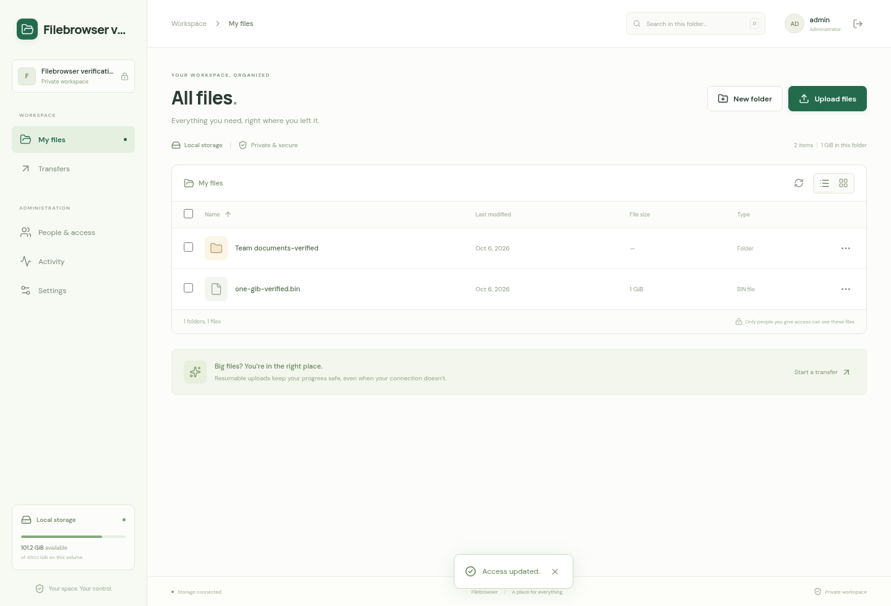
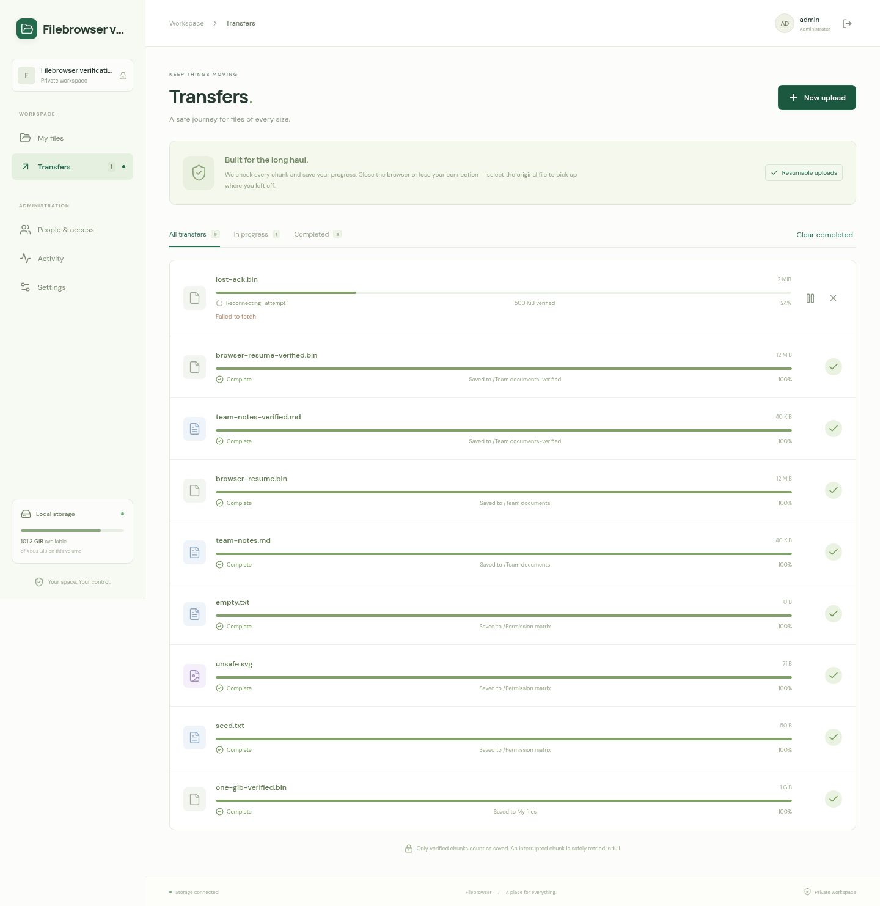
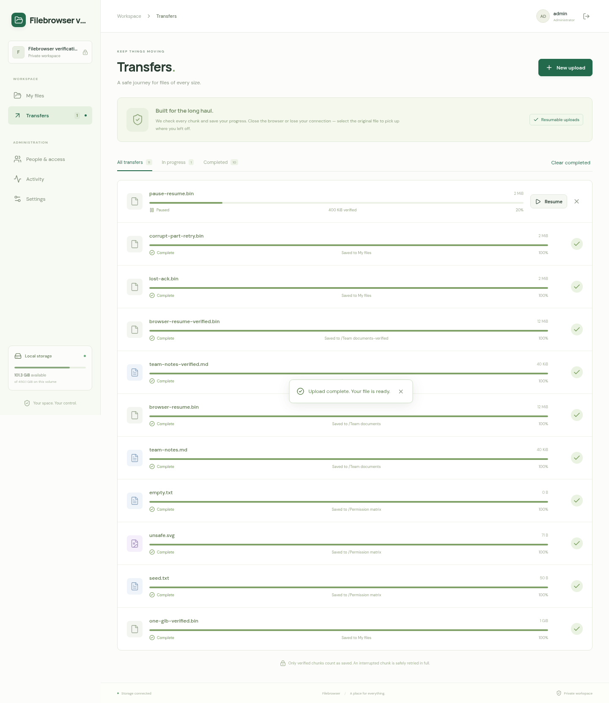
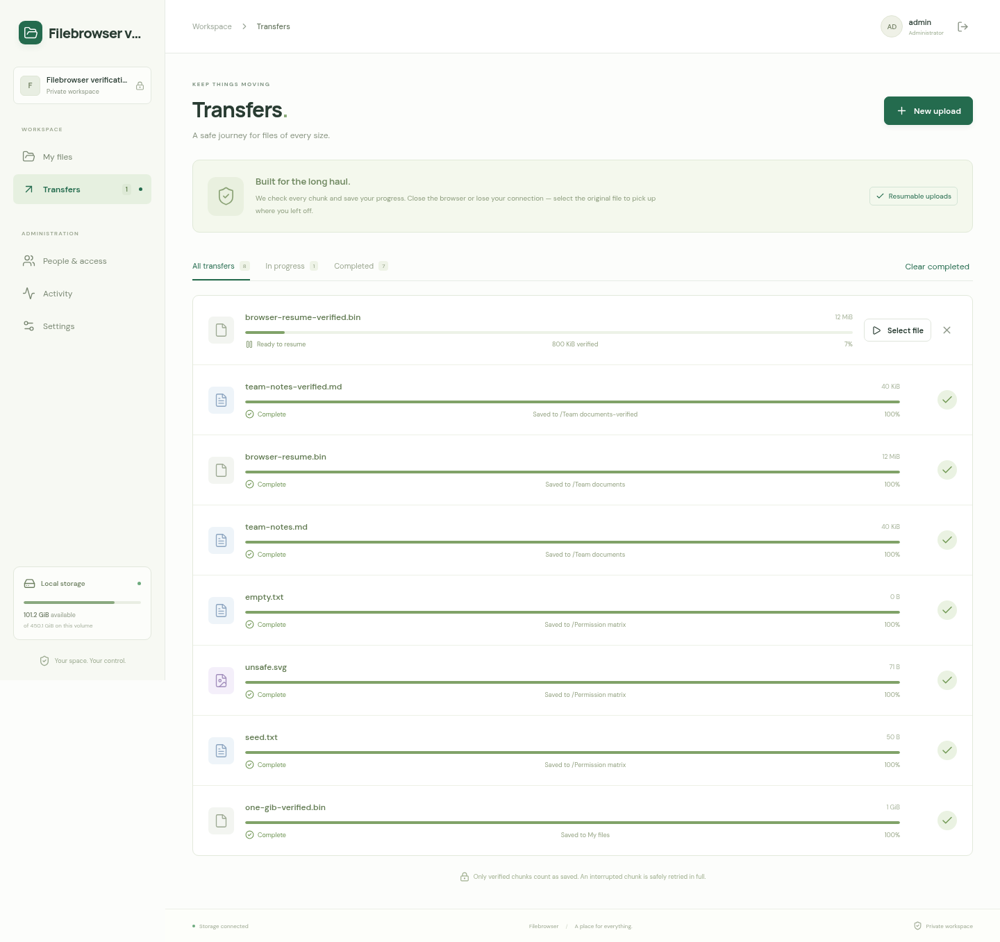
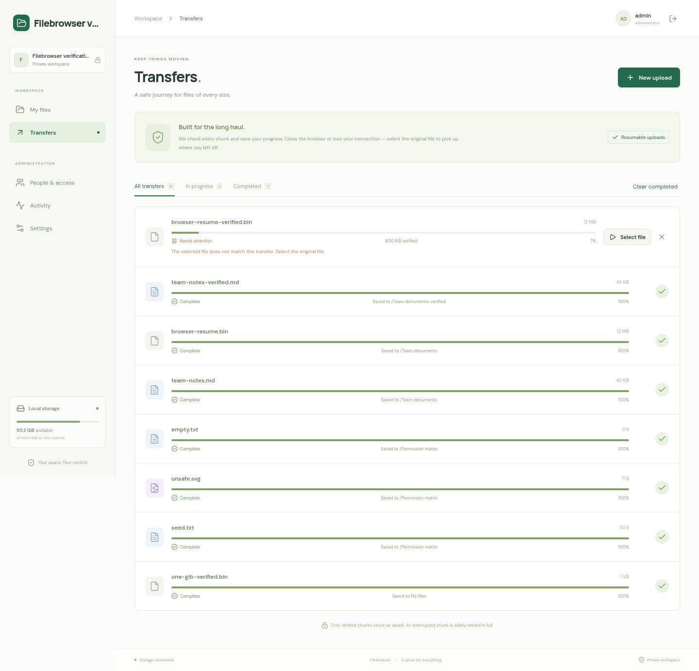
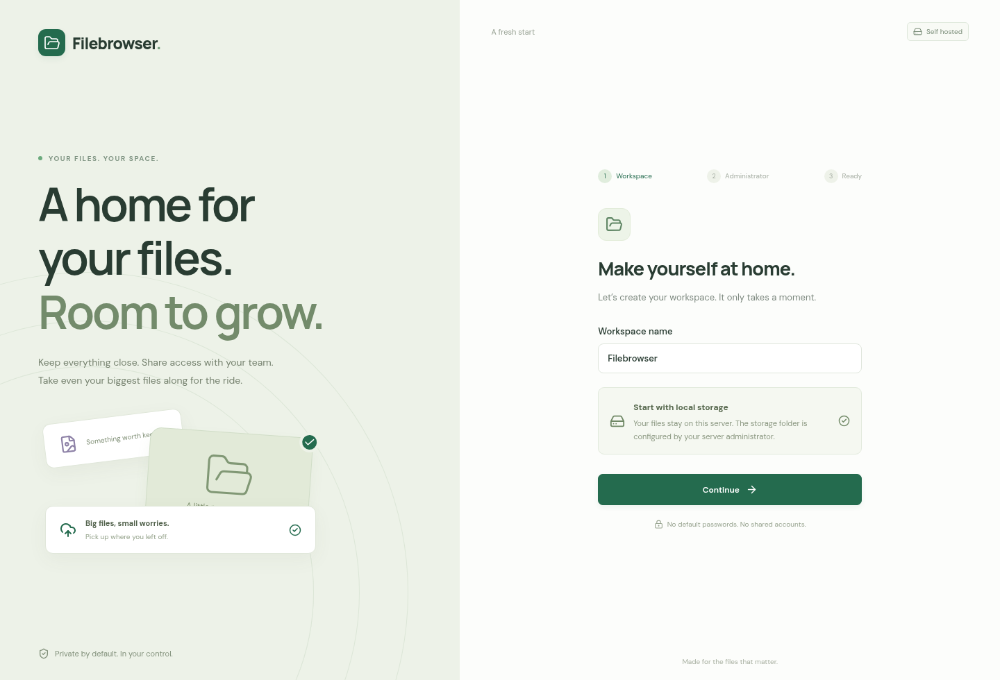
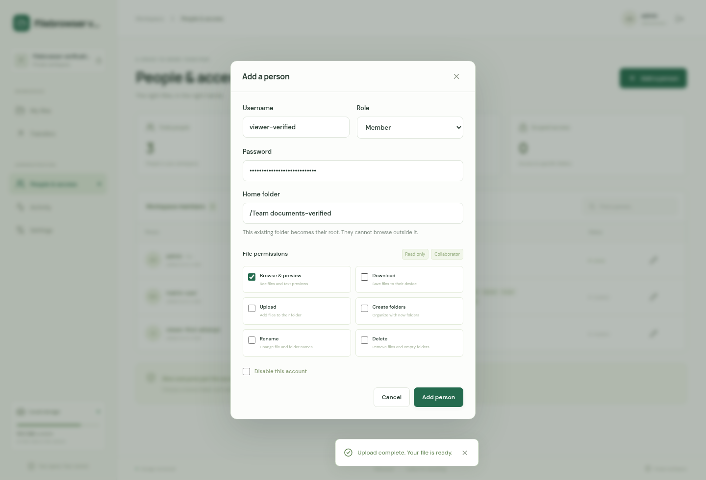
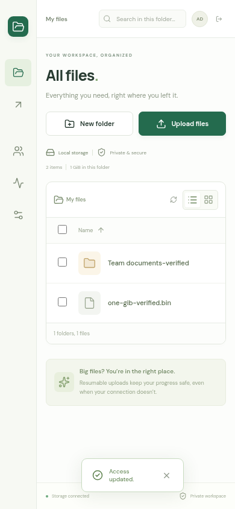

# Filebrowser container verification report

**Result: PASS.** Verified locally on 6 October 2026 using production containers and a real Chromium browser. The application includes the setup wizard, administrator console, scoped permissions, local storage backend, and durable sequential uploads.

The principal transfer sent **1 GiB through 10,486 sequential 100 KiB chunks**, survived a production-server `SIGKILL`, and produced a byte-identical final file. Separate tests exhausted a real filesystem, corrupted a parallel part, lost a successful commit response, resumed after browser reload, and rejected an incorrect source file. Final automated checks passed **25 tests with zero failures and zero skips**. The default **100 MiB** chunk configuration was also exercised through HTTP and the browser.

This is broad functional and fault-injection verification. A complete 200 GB transfer and physical machine power-loss tests have not been performed.

## Environment and provenance

| Item | Verified value |
| --- | --- |
| Starter | `KevinWang15/ts-fullstack-starter`, commit `260e5a088d8abeb6dbd2289f05d224cbe9f78ff8` |
| Host | Linux `6.8.0-142-generic`, x86-64 |
| Docker / Compose | `29.1.3` / `2.40.3` |
| Container Node / npm | `v24.21.0` / `11.19.0` |
| Browser | Chromium `152.0.7977.54`, launched through Playwright |
| Optional starter database | PostgreSQL `18.6`, separate disposable container |
| Application persistence | Node SQLite, WAL, `synchronous=FULL`; separate file and state volumes |
| Production service account | `uid=1000(node)`, `gid=1000(node)` |
| Production chunk default | `104,857,600` bytes = 100 MiB |
| Stress-test override | `FB_UPLOAD_CHUNK_SIZE=102400` = 100 KiB |
| Override's advertised file limit | `1,228,800,000` bytes, fitting the 12,000-chunk limit |
| Disk-pressure fixture | 32 MiB `/files` tmpfs; separate 16 MiB `/state` tmpfs |
| Browser viewports | Desktop 1440 × 980; mobile 390 × 844 |

All accounts and fixture files were created in the dedicated `filebrowser-verify` Compose project. The browser reached the production app over the container network at `http://filebrowser.internal:3000`; the host reached it at `http://127.0.0.1:3320`. The test runner mounted the file volume read-only to inspect actual staged and published bytes.

[Environment and image identities](environment.json) record the precise images, lockfile digest, and final frontend digest. The server bundle's SHA-256 was identical before and after the frontend navigation fix:

```text
1c0603b4490a56881a45721864933c9570625e9e5c777bff446dc3a5e3477a67
```

## Verification matrix

| Suite | Result | Evidence |
| --- | --- | --- |
| Lint, TypeScript, frontend/server production builds | PASS | [Final container check log](logs/container-check-final.log), [final lint](logs/final-lint.log) |
| Backend, recovery, production packaging, starter tooling, and PostgreSQL | 25 passed; 0 failed; 0 skipped | [Final check log](logs/container-check-final.log) |
| Actual 100 MiB HTTP chunk, four connections, dropped TCP connection, sequential tail, 200 GiB manifest | PASS | [Final check log](logs/container-check-final.log) |
| Chromium with default chunks: 101 MiB, interruption after 100 MiB, reload/reselect, matching SHA-256, scoped users, revocation, mobile | 1 workflow passed | [Final browser log](logs/default-e2e-final.log), [validation record](default-e2e/filebrowser-setup-file-ope-aec1f-ped-users-and-mobile-layout/validation.txt) |
| Production-container 1 GiB stress transfer | 17 named checks passed | [Results](large-upload-results.json), [log](logs/large-upload.log) |
| Real capacity exhaustion and append `ENOSPC` | 4 named checks passed | [Results](disk-results.json), [log](logs/disk-pressure.log), [fault injection](logs/enospc-injection.log) |
| Independent grants/denials of all six file permissions and API security | 16 named checks passed | [Results](api-results.json), [log](logs/api-verification.log) |
| First-run production browser wizard | 3 named checks passed | [Results](browser-setup-results.json), [log](logs/browser-setup.log) |
| Production browser: files, users, resume, incorrect source, revocation, settings, mobile | 10 named checks passed | [Results](browser-finish-results.json), [log](logs/browser-finish.log) |
| Browser: lost commit response, corrupted parallel part, pause/resume hash cache, cancellation | 5 named checks passed | [Results](browser-fault-results.json), [log](logs/browser-faults.log) |
| Production server kill/restart and memory sampling | PASS; 154 samples | [Fault results](fault-injection-results.json), [samples](container-resource-samples.json), [log](logs/fault-injection.log) |
| Dependency audit | 0 reported vulnerabilities | [Full dependency audit](logs/dependency-audit.json), [production audit](logs/production-runtime-audit.log) |
| Final 1 GiB file after the production container was recreated | PASS; same size, inode, and SHA-256 | [Final file check](logs/final-large-file-check.log) |

Suite counts describe checks at different levels; they should not be interpreted as independent coverage percentages.

## 1 GiB transfer: exact observations

The source contains a distinct deterministic pattern for each chunk, including its index. The harness calculated every chunk checksum and the expected whole-file hash before initialization. It generated source bytes incrementally, sent requests over HTTP, inspected the actual chunk file before every commit, and asserted the next index and durable offset after **every** commit.

| Measurement | Observation |
| --- | --- |
| File size | `1,073,741,824` bytes |
| Chunk size / count | `102,400` bytes / `10,486` chunks |
| Final chunk | `77,824` bytes |
| Transfer start / completion, UTC | `11:38:38` / `11:44:37` on 2026-10-06 |
| Transfer and final verification duration | `350.1` seconds, including the controlled restart |
| Four-connection chunks | `106`; remaining chunks used one connection |
| Replayed successful commits | `42`; none appended bytes twice |
| Largest observed temporary chunk file | `102,400` bytes |
| Kill checkpoint | `4,096` committed chunks; `419,430,400` bytes = 400 MiB |
| Offset after restart | Exactly `419,430,400` bytes; same authenticated session resumed |
| Server host PID across kill | `2129585` → `2161938` |
| Staged/published inode | `3772074`, unchanged at publication and final recheck |
| Staging after completion | Empty; no chunk pieces retained |
| Container memory samples | `70.64`–`194.8` MiB; final sample `152.4` MiB |

The expected and actual whole-file SHA-256 were:

```text
50a231f30de9bb7e2905a389f7f99a2d53d7e5be17981bcb3a83b4c6052b6644
```

The 100 KiB override exercises approximately 5.12 times the commit count of a 200 GiB file using default 100 MiB chunks. This deliberately measures repeated durable commits and recovery. Container memory was sampled about every two seconds during the transfer, including health probes and concurrent tests; these figures describe this run rather than a universal memory ceiling.

Additional assertions rejected starting chunk 1 before chunk 0, malformed manifests, unsafe names, checksum corruption, short parts, and stale attempt tokens. A failing part forcibly closed a stalled sibling. Initialization, commit replay, and completion were idempotent. A completed destination could not be overwritten. An HTTP byte range from chunk 2,048 returned the expected distinct bytes.



## Crash, network, and disk recovery

The automated subprocess tests used `SIGKILL` at two precise points: after the verified target append but before committing metadata, and after publishing the destination but before committing completion. Recovery discarded an uncommitted tail or recognized the published inode as appropriate, without duplicate bytes. Another test deliberately removed committed bytes and required a visible failed transfer instead of silently continuing after a gap.

The production-container kill was performed after 400 MiB had been acknowledged. The server restarted from persistent volumes, released and reacquired its OS-managed locks, preserved its cookie session, and resumed at the exact saved offset.

The disk-pressure test first hit the capacity guard on a real 32 MiB filesystem. It retained `16,588,800` committed bytes and returned HTTP 507. After removing an 8 MiB filler, the next chunk was staged. The host then wrote another filler until the filesystem reported actual `ENOSPC` and **zero available bytes**. Committing the staged chunk returned 507 and left both the committed offset and chunk index unchanged. After freeing space, the same transfer completed at `20,971,520` bytes with this whole-file checksum:

```text
386e98830b84502a4e7325c9bc2b05de23c054bb896f2ed9b9e3edfd7ab91562
```

The extra browser fault tests went beyond replaying API calls. A Playwright route let a chunk commit successfully on the server, then discarded the response before the browser could receive it. The browser queried the authoritative offset and completed with the correct full-file checksum. Another route changed one byte in one of four parallel part requests; checksum verification rejected the entire chunk at offset zero, and the browser retried it successfully.

Same-tab pause/resume was checked by counting hashing workers: it created only one worker for that file and reused the manifest after resume. Canceling a browser transfer after four committed chunks removed its staging directory and left no published partial file.





## Browser reload and file identity

The production browser hashed a `12,582,912`-byte file into 100 KiB chunks and used four connections within each chunk. The test interrupted the start of chunk 8 after `819,200` bytes had committed, then reloaded the page. The transfer returned as “Ready to resume.” Selecting a same-size source with one changed byte was rejected without advancing the offset. Selecting the correct source immediately afterward resumed and produced the matching whole-file hash.

The separate default-configuration browser test hashed and uploaded 101 MiB, interrupted after the first real 100 MiB chunk, reloaded, selected the source again, and checked the final SHA-256.





## Setup and access management

The administrator was created through the real first-run wizard; a second setup request was rejected. Browser and API tests covered folder creation, selection, rename, list/grid views, plain-text preview, byte-identical downloads, suffix ranges, invalid ranges, empty-file publication, and unsafe-markup attachment delivery.

Permissions were tested independently: an account with every permission disabled received 403 for browse, download, upload, create, rename, and delete. Granting each permission alone enabled its own action. Every access edit revoked the old session. Scoped users saw their assigned folder as `/`, could not traverse upward, could not access another owner's transfer, and could not call administrator endpoints. Symlink access and reserved application paths were also rejected.

Administrator password reset, member disabling, the last-enabled-administrator guard, password-change logout, and subsequent login were verified. The final browser workflow reported zero unhandled JavaScript errors. Mobile navigation remained accessible by name and the page had no horizontal overflow at 390 × 844.







## Issues found and resolved

1. **File navigation and revoked sessions:** returning from account settings to My files reused a cached listing. File navigation now refreshes the listing, allowing a revoked session to return to the login screen. A regression assertion was added to the default browser workflow, and both browser workflows passed afterward.
2. **Canceled-writer cleanup timing in the test harness:** a socket can close before the old writer finishes its final cleanup. The harness now retries only `UPLOAD_BUSY` for a bounded three seconds. The server retains its fencing rule until old writers have closed. The successful stress run required zero such retries, while the initial run exposed this legitimate race.
3. **Container browser hostname:** Chromium treats `.app` names as HTTPS-only. The verification service uses the `filebrowser.internal` network alias so the intended local HTTP tests run correctly.

The initial attempts are retained under [logs/initial-attempts](logs/initial-attempts/) for transparency. Final PASS results and screenshots refer to the corrected runs. The frontend fix left the verified server bundle unchanged; the 1 GiB file's size, inode, and full checksum were rechecked after recreating the production container.

## Upload design assessment and boundaries

Sequential chunks with bounded temporary storage are a sound fit for the local backend. Robustness requires three additions beyond per-chunk checksums: **durable acknowledgments, idempotent commits, and recoverable publication**. The implementation verifies the staged chunk, appends at the saved offset, syncs the target, commits metadata with SQLite FULL synchronization, and only then acknowledges. A failed attempt discards the entire chunk. Publication links the completed target on the same filesystem and syncs its directory; it performs no final full-file concatenation or copy.

The upfront checksum scan remains a cost: at 100 MiB/s, scanning 200 GiB takes roughly 34 minutes before upload, and uploading reads the source again. A worker reads through 4 MiB buffers; browser reload requires another scan to prove the selected source matches. Same-tab pause/resume reuses the existing manifest. The local adapter streams parts and appends with bounded buffers, and parsed immutable manifests use an eight-entry LRU.

The storage contract is a TypeScript abstraction informed by rclone's filesystem operations and optional capabilities. The shipped adapter is local. A future remote/rclone adapter must supply its own correct commit/publication semantics; many object stores require multipart upload instead of append and hard links.

Remaining validation boundaries:

- Full 200 GB transfer duration, physical power cuts, failing hardware, and silent disk corruption remain deployment-hardware tests. The 200 GiB manifest/metadata path and more than 10,000 real durable commits were checked.
- Durability assumes a local Linux filesystem and hardware honoring file/directory `fsync`, SQLite locking, and same-volume hard links.
- Unrelated host processes must not replace application-owned directories concurrently. Symlink rejection and `O_NOFOLLOW` do not supply every directory-descriptor confinement primitive.
- TLS reverse-proxy behavior, Firefox/Safari, very long offline periods, and large multi-user load were not tested. A proxy should stream request bodies with buffering disabled and suitable timeouts.
- Chunk hashes verify data before commitment; the application does not continuously rehash committed data for later disk bit rot.

## Reproduction

Run from the project root with Docker and Node 24 available. Use fresh verification volumes and an empty evidence directory; old checkpoint markers can otherwise interfere with fault injection. For a repeat run, archive `verification/` first, then remove only the disposable verification project using `docker compose -p filebrowser-verify -f compose.verify.yml down -v`.

```sh
dcv() { docker compose -p filebrowser-verify -f compose.verify.yml "$@"; }
mkdir -p verification/logs verification/screenshots
dcv build
dcv up -d --wait app database diskfull

dcv run --rm --no-deps runner npm run check
dcv run --rm --no-deps runner npm run test:e2e -- --output=/evidence/default-e2e
dcv run --rm --no-deps runner node scripts/verify-container-browser.mjs setup

dcv run --rm --no-deps runner node scripts/verify-container-upload.mjs \
  > verification/logs/large-upload.log 2>&1 &
VERIFY_LARGE_PID=$!
dcv run --rm --no-deps runner node scripts/verify-container-disk.mjs \
  > verification/logs/disk-pressure.log 2>&1 &
VERIFY_DISK_PID=$!
node scripts/verify-container-faults.mjs
wait "$VERIFY_LARGE_PID"
wait "$VERIFY_DISK_PID"

dcv run --rm --no-deps runner node scripts/verify-container-api.mjs
dcv run --rm --no-deps runner node scripts/verify-container-browser.mjs finish
dcv run --rm --no-deps runner node scripts/verify-container-browser-faults.mjs
```

The final browser phase changes the fixture administrator password, so it follows the API and large-transfer phases. The fault-browser phase uses that changed fixture password. The harness directory bundled with this report preserves the exact scripts and container configuration; application source is in the project workspace. All passwords embedded in those harnesses are disposable test fixtures.

## Screenshot index

| Screenshot | Verified state |
| --- | --- |
| [01](screenshots/01-setup-workspace.png) | First-run workspace step |
| [02](screenshots/02-setup-administrator.png) | Administrator password creation |
| [03](screenshots/03-setup-review.png) | Setup review |
| [04](screenshots/04-first-run-files.png) | Newly initialized workspace |
| [05](screenshots/05-upload-options.png) | Four connections per chunk |
| [06](screenshots/06-text-preview.png) | Text preview |
| [07](screenshots/07-files-list.png) | Renamed file in list view |
| [08](screenshots/08-files-grid.png) | Grid view |
| [09](screenshots/09-interrupted-transfer.png) | Interrupted transfer retaining verified bytes |
| [10](screenshots/10-reload-resume.png) | Resume after reload |
| [11](screenshots/11-wrong-source-rejected.png) | Incorrect source rejected |
| [12](screenshots/12-completed-transfers.png) | Browser transfer completed |
| [13](screenshots/13-scoped-permissions.png) | Scope and individual permissions |
| [14](screenshots/14-people-and-access.png) | Administrator user console |
| [15](screenshots/15-member-account-settings.png) | Scoped member account settings |
| [16](screenshots/16-last-admin-protection.png) | Last administrator demotion rejected |
| [17](screenshots/17-workspace-activity.png) | Durable activity history |
| [18](screenshots/18-runtime-configuration.png) | Advertised 100 KiB runtime chunk size |
| [19](screenshots/19-one-gib-file-in-workspace.png) | Verified 1 GiB file |
| [20](screenshots/20-mobile-workspace.png) | Mobile layout |
| [21](screenshots/21-lost-acknowledgment-recovery.png) | Lost successful commit response |
| [22](screenshots/22-corrupt-part-whole-chunk-retry.png) | Corrupted part and whole-chunk retry |
| [23](screenshots/23-paused-transfer.png) | Same-tab pause |
| [24](screenshots/24-canceled-transfer.png) | Explicit cancellation |
| [Default chunk browser evidence](default-e2e/filebrowser-setup-file-ope-aec1f-ped-users-and-mobile-layout/transfers.png) | 101 MiB browser transfer using production-default chunk size |

The bundle contains these 24 production-browser screenshots plus six screenshots from the default-configuration browser workflow, logs, machine-readable results, resource samples, and reproduction harnesses. It excludes file fixtures, account databases, cookies, and access tokens.
