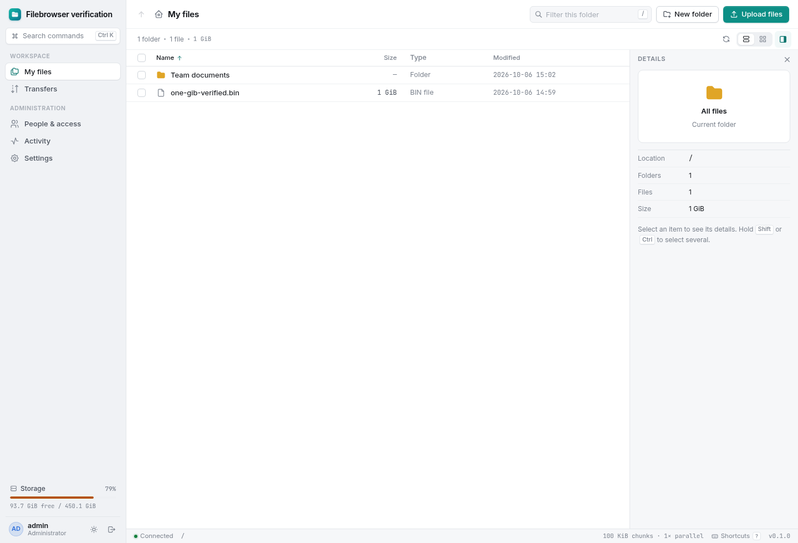
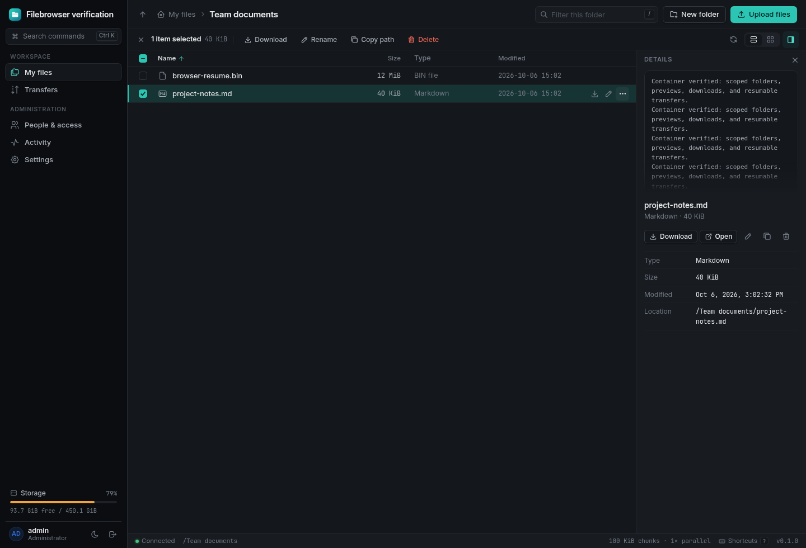
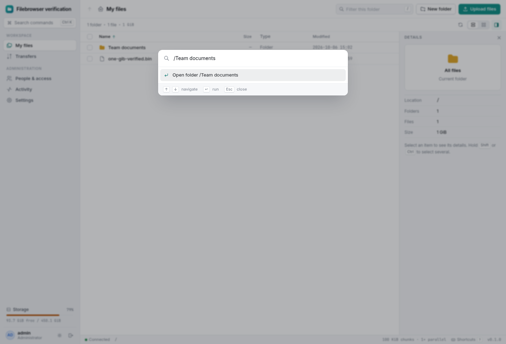
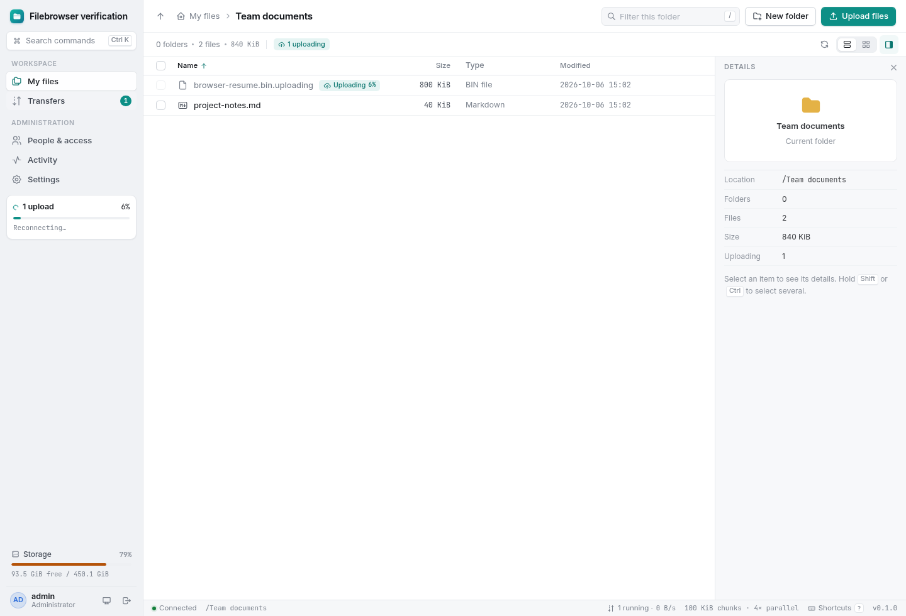
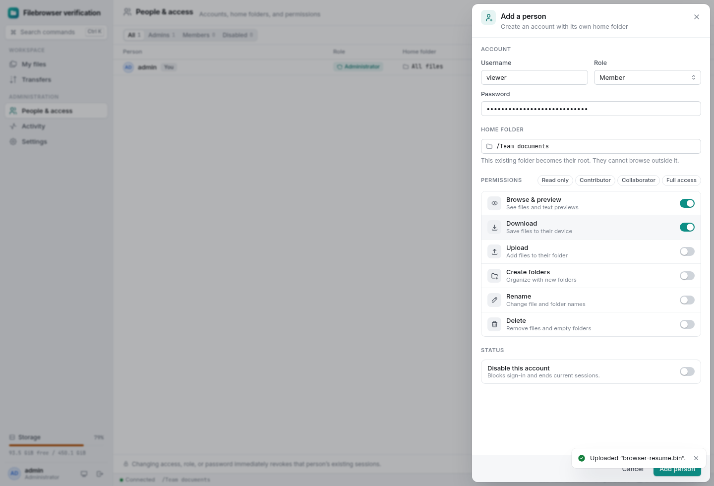
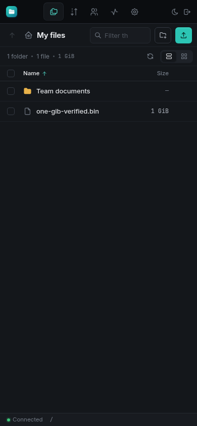

# Filebrowser verification report — frontend redesign

**Result: PASS.** On 6 October 2026, `frontend-redesign` was fetched and merged directly into `main` without conflicts. The merged application passed container verification and has **48 fresh screenshots**: 40 from the production container and eight from the default-chunk browser test. Both light and dark themes, desktop, mobile, and tablet layouts are included.

The container suite passed **32 tests, zero failures, zero skips**, including PostgreSQL. The default browser test uploaded **101 MiB with 100 MiB chunks**, interrupted the second chunk, reloaded, reselected the source, and verified byte-identical completion. Production browser runs passed **30 checks** across setup (3), file/access workflows (11), upload faults (5), and redesign workflows (11), with no unhandled JavaScript errors.

## Merge and tested application

| Item | Value |
| --- | --- |
| Redesign branch | `frontend-redesign` |
| Redesign commit | `e606bfb84c49db52ff6142d42a67c2a5f4220f9f` |
| Direct merge commit on main | `d381dc44b4ef3c813d0c9c7552f38bbfa1062ba2` |
| Previous main | `de812b2441b73fa8b82d8ab1373fbbd986eb1ed1` |
| Compose project | `filebrowser-redesign-verify`, fresh files/state fixtures |
| Container Node / npm | `v24.21.0` / `11.19.0` |
| Docker / Compose | `29.1.3` / `2.40.3+ds1-0ubuntu1~24.04.1` |
| Browser | Chrome for Testing 152.0.7977.54 via Playwright |
| Production test chunk override | 102,400 bytes = 100 KiB |
| Default chunk configuration | 104,857,600 bytes = 100 MiB |
| Viewports | 1440 × 980, 390 × 844, 768 × 844 |

[Environment, image identities, source digests, and comparison](frontend-redesign/environment.json) record the tested application. The merge replaces the UI with modular views, file inspectors and menus, a command palette, hash navigation, and appearance preferences. The backend and shared API sources are unchanged. The rebuilt production server bundle is byte-identical to the earlier verified server:

```text
7cc5e3e7d0a57e0ea37026fe4880cb9484d7646039e4f81223218405834b7030
```

The [previous report](REPORT-before-frontend-redesign.md), its 1 GiB stress test, crash recovery, disk-pressure tests, and permission matrix remain preserved. Those heavy production stress runs were **not repeated** for this frontend merge. Their evidence is retained because the backend sources and server bundle match exactly; the 32-test suite and browser recovery workflows were rerun against the merged application.

The 1 GiB file shown in the new UI was **copied from the previously verified container volume**, rather than uploaded again. [The fixture record](frontend-redesign/seeded-fixture.json) verifies its size and full SHA-256 after copying:

```text
1,073,741,824 bytes
50a231f30de9bb7e2905a389f7f99a2d53d7e5be17981bcb3a83b4c6052b6644
```

## Fresh verification results

| Area | Result | Evidence |
| --- | --- | --- |
| Container build, TypeScript and production packaging | PASS | [Build log](frontend-redesign/logs/docker-build.log) |
| Lint, build, backend/storage/crash tests, optional starter PostgreSQL | 32 passed; no failures or skips | [Container check](frontend-redesign/logs/container-check.log) |
| Default 100 MiB chunks, 101 MiB browser upload and reload/resume | PASS; 46.2 s including browser fixture startup | [Browser log](frontend-redesign/logs/default-e2e.log), [validation](frontend-redesign/default-e2e/filebrowser-setup-file-ope-aec1f-ped-users-and-mobile-layout/validation.txt) |
| Real first-run wizard and setup lock | 3 checks passed | [Setup results](frontend-redesign/browser-setup-results.json), [log](frontend-redesign/logs/browser-setup.log) |
| Files, permissions, 12 MiB browser upload, interruption/reload, wrong-source rejection | 11 checks passed | [Workflow results](frontend-redesign/browser-finish-results.json), [log](frontend-redesign/logs/browser-finish.log) |
| Lost committed response, corrupt parallel part, pause/resume, cancellation | 5 checks passed | [Fault results](frontend-redesign/browser-fault-results.json), [log](frontend-redesign/logs/browser-faults.log) |
| Command palette, history, filtering/sorting, menus, preferences, inspector, responsive layouts | 11 checks passed | [Redesign results](frontend-redesign/browser-redesign-results.json), [log](frontend-redesign/logs/browser-redesign.log) |
| Final staging and pending-file cleanup | PASS; three completed files, one link each | [Filesystem state](frontend-redesign/final-filesystem-state.json) |

The browser verified a lost successful commit response by consulting the durable server offset and completing without duplicate bytes. Corrupting a parallel part returned a checksum rejection with zero committed bytes before retrying the whole chunk. Same-tab pause/resume retained one hashing worker and manifest. Cancellation after four committed chunks removed staging and the visible suffix, and never published a partial file.

Pending files remain labeled “Uploading” in list and grid views. Their selection controls are disabled and their viewer exposes no download or rename action. The resumed 12 MiB file matched its source checksum. Scoped members could neither upload nor administer the workspace, and direct download/traversal attempts were denied. Disabling a user and changing a password revoked the respective browser sessions; the last enabled administrator could not be demoted.

New checks verify encoded folder URLs across reload and browser back/forward, Ctrl+K folder navigation, Enter to execute commands, filtering and sorting, context-menu dismissal, persistent grid layout, theme and density settings, transfer/activity filters, keyboard navigation, and accessible navigation without horizontal page overflow at 390 and 768 pixels. The screenshot harness disables finite animations when capturing preference changes so the images show settled colors. No application fixes were needed after merging.

## Screenshots













Every production screenshot is linked below; all were captured from successful runs of the merged production frontend.

| Screenshot | Image |
| --- | --- |
| 01 — setup workspace | [PNG](frontend-redesign/screenshots/01-setup-workspace.png) |
| 02 — setup administrator | [PNG](frontend-redesign/screenshots/02-setup-administrator.png) |
| 03 — setup review | [PNG](frontend-redesign/screenshots/03-setup-review.png) |
| 04 — first run files | [PNG](frontend-redesign/screenshots/04-first-run-files.png) |
| 05 — upload options | [PNG](frontend-redesign/screenshots/05-upload-options.png) |
| 06 — text preview | [PNG](frontend-redesign/screenshots/06-text-preview.png) |
| 07 — files list | [PNG](frontend-redesign/screenshots/07-files-list.png) |
| 08 — files grid | [PNG](frontend-redesign/screenshots/08-files-grid.png) |
| 09 — interrupted transfer | [PNG](frontend-redesign/screenshots/09-interrupted-transfer.png) |
| 10 — reload resume | [PNG](frontend-redesign/screenshots/10-reload-resume.png) |
| 11 — wrong source rejected | [PNG](frontend-redesign/screenshots/11-wrong-source-rejected.png) |
| 12 — completed transfers | [PNG](frontend-redesign/screenshots/12-completed-transfers.png) |
| 13 — scoped permissions | [PNG](frontend-redesign/screenshots/13-scoped-permissions.png) |
| 14 — people and access | [PNG](frontend-redesign/screenshots/14-people-and-access.png) |
| 15 — member account settings | [PNG](frontend-redesign/screenshots/15-member-account-settings.png) |
| 16 — last admin protection | [PNG](frontend-redesign/screenshots/16-last-admin-protection.png) |
| 17 — workspace activity | [PNG](frontend-redesign/screenshots/17-workspace-activity.png) |
| 18 — runtime configuration | [PNG](frontend-redesign/screenshots/18-runtime-configuration.png) |
| 19 — one gib file in workspace | [PNG](frontend-redesign/screenshots/19-one-gib-file-in-workspace.png) |
| 20 — mobile workspace | [PNG](frontend-redesign/screenshots/20-mobile-workspace.png) |
| 21 — lost acknowledgment recovery | [PNG](frontend-redesign/screenshots/21-lost-acknowledgment-recovery.png) |
| 22 — corrupt part whole chunk retry | [PNG](frontend-redesign/screenshots/22-corrupt-part-whole-chunk-retry.png) |
| 23 — paused transfer | [PNG](frontend-redesign/screenshots/23-paused-transfer.png) |
| 24 — canceled transfer | [PNG](frontend-redesign/screenshots/24-canceled-transfer.png) |
| 25 — uploading file list | [PNG](frontend-redesign/screenshots/25-uploading-file-list.png) |
| 26 — uploading file details | [PNG](frontend-redesign/screenshots/26-uploading-file-details.png) |
| 27 — uploading file grid | [PNG](frontend-redesign/screenshots/27-uploading-file-grid.png) |
| 28 — redesigned light workspace | [PNG](frontend-redesign/screenshots/28-redesigned-light-workspace.png) |
| 29 — file inspector | [PNG](frontend-redesign/screenshots/29-file-inspector.png) |
| 30 — command palette folder | [PNG](frontend-redesign/screenshots/30-command-palette-folder.png) |
| 31 — file context menu | [PNG](frontend-redesign/screenshots/31-file-context-menu.png) |
| 32 — redesigned dark workspace | [PNG](frontend-redesign/screenshots/32-redesigned-dark-workspace.png) |
| 33 — redesigned dark grid | [PNG](frontend-redesign/screenshots/33-redesigned-dark-grid.png) |
| 34 — redesigned dark settings | [PNG](frontend-redesign/screenshots/34-redesigned-dark-settings.png) |
| 35 — redesigned dark transfers | [PNG](frontend-redesign/screenshots/35-redesigned-dark-transfers.png) |
| 36 — redesigned dark people | [PNG](frontend-redesign/screenshots/36-redesigned-dark-people.png) |
| 37 — redesigned dark activity | [PNG](frontend-redesign/screenshots/37-redesigned-dark-activity.png) |
| 38 — keyboard shortcuts | [PNG](frontend-redesign/screenshots/38-keyboard-shortcuts.png) |
| 39 — redesigned dark mobile | [PNG](frontend-redesign/screenshots/39-redesigned-dark-mobile.png) |
| 40 — redesigned dark tablet | [PNG](frontend-redesign/screenshots/40-redesigned-dark-tablet.png) |

The separate default-chunk browser test captured these eight images:

| Screenshot | Image |
| --- | --- |
| files grid | [PNG](frontend-redesign/default-e2e/filebrowser-setup-file-ope-aec1f-ped-users-and-mobile-layout/files-grid.png) |
| files list | [PNG](frontend-redesign/default-e2e/filebrowser-setup-file-ope-aec1f-ped-users-and-mobile-layout/files-list.png) |
| mobile | [PNG](frontend-redesign/default-e2e/filebrowser-setup-file-ope-aec1f-ped-users-and-mobile-layout/mobile.png) |
| people | [PNG](frontend-redesign/default-e2e/filebrowser-setup-file-ope-aec1f-ped-users-and-mobile-layout/people.png) |
| setup | [PNG](frontend-redesign/default-e2e/filebrowser-setup-file-ope-aec1f-ped-users-and-mobile-layout/setup.png) |
| transfers | [PNG](frontend-redesign/default-e2e/filebrowser-setup-file-ope-aec1f-ped-users-and-mobile-layout/transfers.png) |
| uploading details | [PNG](frontend-redesign/default-e2e/filebrowser-setup-file-ope-aec1f-ped-users-and-mobile-layout/uploading-details.png) |
| uploading file | [PNG](frontend-redesign/default-e2e/filebrowser-setup-file-ope-aec1f-ped-users-and-mobile-layout/uploading-file.png) |

## Reproduction

Use only disposable verification fixtures. The screenshot workflows require a fresh setup state. The `finish` and redesign harnesses expect the previously verified `one-gib-verified.bin` fixture; first reproduce the production stress verification in [the previous report](REPORT-before-frontend-redesign.md) if that baseline volume is unavailable. Do not run setup again against an initialized fixture.

```sh
verify_compose=(docker compose -p filebrowser-redesign-verify -f compose.verify.yml)
verify_run=("${verify_compose[@]}" run --rm -e FB_VERIFY_OUTPUT=/evidence/frontend-redesign)
"${verify_compose[@]}" build app diskfull runner
"${verify_compose[@]}" up -d --wait app diskfull database
"${verify_run[@]}" runner npm run check
"${verify_run[@]}" runner npx playwright test --output=/evidence/frontend-redesign/default-e2e
"${verify_run[@]}" runner node scripts/verify-container-browser.mjs setup
# Copy only the verified completed fixture into the fresh screenshot workspace.
docker run --rm --user 0 \
  --mount type=volume,src=filebrowser-verify_verify-files,dst=/baseline,readonly \
  --mount type=volume,src=filebrowser-redesign-verify_verify-files,dst=/fixture-files \
  node:24-bookworm-slim node --input-type=module -e '
    import {copyFile, chown, constants} from "node:fs/promises";
    const target="/fixture-files/one-gib-verified.bin";
    await copyFile("/baseline/one-gib-verified.bin",target,constants.COPYFILE_EXCL);
    await chown(target,1000,1000);
  '
"${verify_run[@]}" runner node scripts/verify-container-browser.mjs finish
"${verify_run[@]}" runner node scripts/verify-container-browser-faults.mjs
"${verify_run[@]}" runner node scripts/verify-container-redesign.mjs
"${verify_compose[@]}" stop app diskfull database
```

The actual capture seeded and checksum-verified the 1 GiB fixture before setup. The development server also serves the merged frontend. The user's local files and account state were not reset; verification containers are stopped after collection and their fixture volumes are retained.

## Limits and bundle integrity

This verifies the merged frontend in Linux containers using Chromium; it is not a Safari/Firefox or physical-device compatibility matrix. The retained backend evidence includes an actual 1 GiB transfer, an actual 100 MiB chunk, 200 GiB manifest validation, SIGKILL boundary tests, and real ENOSPC recovery. A full 200 GB payload, physical power loss, faulty disks/RAM, and remote storage adapters remain untested.

Downloads support byte ranges; strong file-version validators (`ETag`/`If-Range`) and native-browser download interruption/resumption tests remain future work.

The refreshed tar.gz contains this report, all fresh screenshots and result/log files, and the preserved baseline evidence. `MANIFEST.sha256` covers packaged evidence. Transfer receipts and older tar.gz files are excluded. From the extracted bundle root, verify all files with:

```sh
cd verification
sha256sum -c MANIFEST.sha256
```
